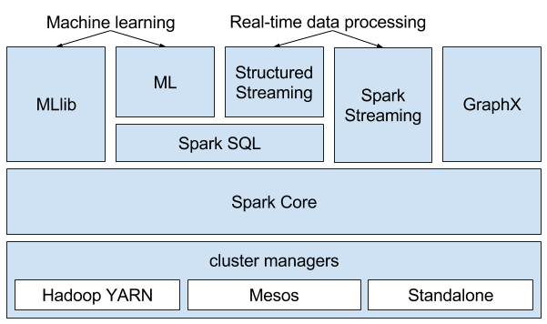
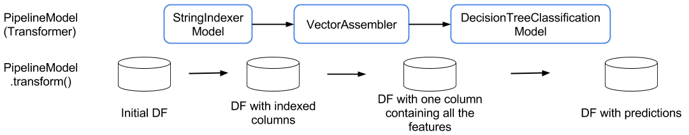

:source-highlighter: coderay
:chapter: 1
:sectnums:
:sectnumoffset: 2
:figure-caption: Figure {chapter}.
:listing-caption: Listing {chapter}.
:table-caption: Table {chapter}.
:leveloffset: 1

= Introduction

This chapter covers:

- What is machine learning?
- What is Apache Spark?
- What is Spark ML?
- The benefits of Spark ML over MLlib
- Core Spark concepts
- Core Spark ML concepts

We are all confronted with large-scale machine learning in our daily lives,
whether it's through buying something on Amazon, watching a TV show or a movie
on Netflix, finding people to follow on Twitter, scrolling through a Facebook
news feed, checking emails on GMail, finding out our bank account has been
frozen because of alleged fraudulent behavior, finding a place to stay on
vacation on AirBnB or hailing an Uber.

Behind those actions, which seem so simple and entrenched in our daily lives,
lies different machine learning domains such as recommender systems (previewing
the next movie you might want to watch), classification (displaying only the
non-spam emails), regression (estimating the fare for your next ride or the
daily rate for the place you're renting for your next holidays), and so on.

Apache Spark and its machine learning library Spark ML, is used by some of
these companies to implement them. For them, as we'll see later in this chapter
and in the book, Spark ML fits the bill perfectly because:

- It's distributed. As you might imagine, you have to be able to deal with a
huge quantity of data.
- It comes with a broad array of machine learning algorithms. All of the use
cases above can be addressed with Spark ML.
- It's easy to use. You'll spend a lot less time onboarding new people or
learning it yourself.
- It's extendable. You have a great idea for a brand new machine learning
algorithm and you want to try it out.
- It's open source. Your new algorithm is revolutionary and you want
everyone to benefit from it.

Fortunately, there are still a lot of large scale machine learning use cases to
be uncovered, as we'll find out throughout the book, some of them probably at
your own company.

I'll introduce you to machine learning, Apache Spark, Spark ML and the core
concepts that will be used throughout the book. If you're already familiar with
those concepts, you can go straight to chapter 2.

== What is machine learning?

Machine learning can be thought of as the ensemble of algorithms that can solve
the problems described above. Those problems are usually too hard for anyone
to solve using an explicit algorithm. For example, how would you suggest a
daily rate for a listing on AirBnB? There are a few machine learning algorithms
dedicated to this type of problem for which this task is better-understood
compared to what you might come up with.

In this section, we'll define a few concepts fundamental to machine learning.

=== Model

A machine learning algorithm will be able to gain insights on data and
represent those insights as a _model_. A model can take many forms such as:

- an equation: in the case of predicting the price of an AirBnB this might be
`f(surface area, nb bedrooms, etc) = suggested price`
- flowcharts made of decision blocks: if this emails contains more than 15
successive capital letters, consider it as a spam
- groupings of data points: fraudulent banking actions on one side and
non-fraudulent on the other side
- etc

=== Structure of the data

In most, if not all, machine learning problems, the data can be represented in
tabular format like so:

.An example dataset describing AirBnB listings
[cols="^.^h,,,,,,,",options="header"]
|===
||Number of bedrooms|Surface area|Latitude|Longitude|Type of accommodation|Number of stars|Hash
.6+|Observations
|3|75|46.8114|1.6868|house|3|71957c2d920e7157c95131b412b32763
|1|9|49.4178|2.8261|apartment|3|b89f097291d169abca0c29fd0c1405f8
|2|40|60.4843|14.4340|apartment|2|7a1c131f7b08da3dd581acc6d9c5f1be
|3|92|53.2707|-9.0568|house|3|749b12d3e54b1f88329adee2fd340372
|1|27|48.8566|2.3522|apartment|1|86711773d8cba579a5e85969051e74dc
|1|40|53.3498|-6.2603|apartment|4|a597d22cd72851ab56a3e5cb4f3baec4
| 7+^.^h|Features
|===

An observation, or an example, is simply a single data point in our dataset. A
feature is a characteristic of an observation (e.g. the number of bedrooms).
When we represent our data in tabular format, a feature is a column and an
observation is a row.

A feature can be numeric like the surface area or categorical like the type of
accommodation. Some categorical features can be ordinal which means that they
take their values in a finite ordered list which is the case of number of stars
which, we assume, takes its values between 1 and 5 and 5 is better than 1.

=== Types of machine learning tasks

Apart from a few exceptions, machine learning algorithms can fall into two
categories: _supervised_ and _unsupervised_ learning.

==== Supervised learning

Supervised learning is used to build predictive models. Predictive models are
used to represent the relationship between a _label_ (also called
_target feature_) and the other features in the dataset.

The label can be _continuous_ (can take an infinite number of values). In this
case, we'll talk about _regression_. Our example is a typical regression task
since the goal is to predict the daily rate, a price which is a continuous
variable, from the other features: number of bedrooms, GPS coordinates, surface
area, type of accomodation and number of stars.

If the label is _discrete_ (takes a finite number of values), we'll talk about
classification. Can you think of classification tasks on our example datasets?
One would be to predict the type of accommodation given the other features:
number of bedrooms, GPS coordinates, daily rate, surface area and number of
stars.

An easy way to tell if your problem belongs to the supervised learning category
is to ask yourself if some function could solve your issue:

`3 x nb of bedrooms + 0.3 x surface area + 2 x nb of stars = suggested price`

==== Unsupervised learning

Unsupervised learning is the category which relates to descriptive models.
Descriptive models will try to uncover structures in the data which are not
obvious at first sight. The most well-known algorithm subcategory for
unsupervised learning is clustering where we try to form groupings of data
points.

=== Approach

Usually, there are a few steps for every machine learning application which we
will more or less follow for every chapter in this book:

- Get data: Every machine learning application starts with some dataset on
which we want to gain some insights. If we continue with our example, this
might be millions of AirBnB listings.
- Identify the problem at hand: In our case, this is predicting the best rate
possible, a regression problem.
- Get to know and prepare the data: This is the most important step because it
will determine the success of your machine learning application. In this step,
you need to ensure that the quality of the data is up to the task. For instance,
if you have 30% of listings that are rented weekly and 70% that have never been
rented since they have been posted, you can be sure that your application will
suffer from poor performance. This type of information is only available after a
careful analysis of the data which, and I can't stress this enough, is crucial.
- Identify the machine learning algorithms that can solve the problem: As we
stated earlier, different machine learning algorithms are able to tackle
different kind of problems. This choice is also going to be influenced by your
constraints. In the different chapters, we'll deal with large datasets, as a
result, we'll have to resort to distributed algorithms.
- Train a model on the data: Once you have your shortlist of algorithms, pick
one and apply it to the data you prepared two steps back. This is usually done
on a subset of the whole dataset called the _training dataset_ (a good rule of
thumb is to take 80% of the original dataset).
- Evaluate your model: Because your algorithm learned from the data contained in
the training dataset it will be biased towards this data, you need to find out
how well your model performs on unseen data which is called the _test dataset_
(the remaining 20% of the original dataset). If we go back to our example, we
might want to see how well our model predicts daily rates in our test dataset.
To do so, we compare what the model found to what the daily rates actually are.
Unfortunately, for some machine learning problems, this technique cannot be
applied. In this case, we'll have to resort to other performance indicators.
- Improve your model: The end goal has always been to get the best model. To get
to this goal there are multiple areas you can investigate (of course, after
applying any of these steps, you'll need to reevaluate your model):
  * Tune the algorithm's parameters: There will almost always be high-level
parameters specific to the algorithm you're using such as a maximum number
of iterations. These are called _hyperparameters_ as opposed to the model
parameters which are learned during the training of the model. Those usually
influence the time your algorithms spends learning but also its performance and
its bias towards the data it learned from. As a result, and we will do that in
the latter chapters, it's always a good idea to try different values for the
different hyperparameters of the algorithm you're using.
  * Change algorithm: Usually, there are multiple algorithms that can solve
a single machine learning problem with each their own trade-offs which might
make them better-suited to your problem. Consequently, you might want to try
other algorithms to see how they compare. This entails tuning the
hyperparameters for each algorithm you try.
  * You can also act on the data to improve the quality of your model by
transforming your existing data so that it better represents the problem you're
trying to solve, this is called _feature engineering_. This mainly translates
into two different ideas:
    ** Feature selection: Not all the available characteristics in your dataset
are useful to your problem. For example, our example dataset contains a Hash
column, we can safely assume that it won't help us find out what the daily price
for this listing should be. Except for trivial cases like this one, before
discarding a feature, we measure its importance. The process of removing useless
features leads to a simpler model (there are less features to consider) which,
in turn, usually yields a better model because it will tend to generalize better
and, as a result, perform better on unseen data.
    ** Feature extraction/creation: Continuing on our example, if you look for
the city, or even neighborhoods for big cities, corresponding to the indicated
GPS coordinates it should represent the problem we're trying to solve better
than the raw coordinates.

Here, we've described the steps for supervised learning tasks. In the case of an
machine learning application which falls in the unsupervised learning category,
we'll follow approximately the same steps, except for the split of the data into
training and test sets.

Once you've gone through those steps you should end up with a model that you
deemed satisfactory with respect to its performance which you can use for the
intended task. Going back to our example, this means suggesting a daily rate for
people wanting to list their accommodation on AirBnB.

Now that we have a broad understanding of machine learning we're ready to see
how it relates to Apache Spark.

== What is Apache Spark?

Apache Spark is an open source cluster computing framework. As such, it can be
seen as the successor to Hadoop MapReduce since it aims to solve the same kinds
of problems but better. As a distributed data processing framework, it
encompasses a few common features such as fault-tolerance and linear scalability
we can find in others such as Hadoop.

However, what sets it apart from its predecessor Hadoop is threefold:

- Speed
- Accessibility
- Great out-of-the-box integration

First and foremost is speed. Let us say you have to sort 100 TB of data, as of
2014, Apache Spark psent thrice less time than Hadoop (1406 seconds compared
to 4328) to sort a dataset of this size (you can check the sorting competition
at http://sortbenchmark.org). Spark relies on memory to store its intermediate
results instead of disk which considerably decreases processing time so you can
spend more time improving your machine learning applcation instead of waiting
for it to finish.

Next, which I think, is as important as Spark's speed, is its accessibility.
A lot of effort has been put into reducing the barrier of entry to be
productive with a big data framework. This translates into a read-eval-print
loop (REPL) which lets you experiment quickly and make quick and
dirty prototypes. This is particularly important if you're in a "fail fast fail
often" mindset.

.REPL
****
A read-eval-print loop can be seen as an interactive environment in which a user
inputs expressions instead of whole classes. As its name implies, its use can be
split into 3 steps:

- It will read the user's input by parsing it
- It will evaluate this input by, for example, calling a method on the
appropriate object with the given parameters
- It will print the result of the operation done during the eval step

It usually facilitates debugging and trying things out quickly.

You can start Spark's REPL by running `spark-shell` located in the `bin/` folder
of yout Spark installation.

Note also that Spark's REPL leverages Scala's.

You can find out more at https://en.wikipedia.org/wiki/Read-eval-print_loop.
****

Another aspect, which goes hand in hand with the REPL, is a simple and
functional API that lets you express distributed data processing operations as
you would write local collection transformations using the Scala API.
Suppose you have to write a program counting words in a file, with Spark you
can do so in 5 lines in a REPL which lets you get feedback about the code you
write as you're writing it. With Hadoop MapReduce, you'd have to write a
mapper, a reducer and a main in one (or more) Java classe, compile it into a JAR
and finally run the application only to find out you get a runtime exception and
you'll have to start the process all over again.

Last but not least, Spark benefits from seamless integration with external data
sources like Hive or Kafka and can be installed on a few different cluster
managers like Hadoop YARN or Mesos which makes integrating Spark with your
existing data infrastructure seamless. If you look at your own data
infrastructure right now, there are certainly components that you'll be able to
leverage when using Spark. For instance, let's say you're currently running
your Hadoop MapReduce jobs over YARN which read data from Apache HBase. You'll
be able to reuse YARN to run your Spark jobs and those Spark jobs will be able
to read from HBase too.
In addition to having great integration with other big data projects, a lot of
functionalities have been baked directly into Spark such as stream processing or
machine learning. This keeps you from having to combine multiple frameworks to
solve your use case as was the case if you wanted to do machine learning using
Apache Mahout on Hadoop. In this regard, Spark is self-sufficient for a lot of
similar use cases.

Now that we have a broad understanding of what Spark is and its strenghts, let's
look under the hood. Figure 1.1 shows you an overview of a Spark cluster and its
two fundamental components _Executor_ and _Driver_:

.Overview of a Spark cluster with two nodes. The _SparkSession_ interacts with the cluster manager to obtain the required computation power. It also interacts with the executors to ditribute work.

On the architecture side, each worker node runs its own Java Virtual Machine
(JVM) process called an Executor in Spark parlance. Each Executor will run its
own set of tasks,
in a multithreaded manner, which have been scheduled by the _SparkSession_. The
SparkSession is the entry point to everything Spark-related and is part of a
driver program, another JVM, that can be run on a worker node or on your own
computer. The SparkSession is also responsible for interacting with the cluster
manager which is responsible for allocating resources to your Spark application.
Note that each JVM in figure 1.1 is denoted by dashed lines.

As opposed to other frameworks, when using Spark you can benefit from different
subprojects which are integral components of Spark. As shown in Figure 1.2,
there are 5 components to Spark:

- Spark Core
- Spark SQL
- Spark Streaming
- MLlib
- GraphX

.The different Spark subprojects: graph processing, stream processing, machine learning and the supported cluster managers

=== Spark Core

As its name implies, Spark Core contains the base set of functionalities you can
expect from a distributed data processing framework: fault tolerance mechanisms,
networking, serialization, interactions with distributed storage, executors,
and so on.

Resilient distributed datasets (RDDs), the low-level programming abstraction in
Apache Spark, are also defined in the core. RDDs can be viewed
as a strongly-typed distributed collection of items. One of the nice things
when dealing with RDDs is that they define the same API you use when dealing
with Scala collections, which reduces considerably the barrier of entry when
using Spark by letting you do all kinds of transformations on distributed data
as you would do them on non-distributed data.

=== Spark SQL

Spark SQL is the module dedicated to structured data processing. As you might
have guessed, it lets you interact with data using SQL; however, that's not all.
Spark SQL also defines two concepts: _DataFrames_ and _Datasets_ which you can
think of as distributed collections of data. I will expand on DataFrames and
Datasets later in this chapter.

The main benefit when using Spark SQL when compared with the traditional RDD API
is that all the operations performed with Spark SQL go through an optimizer
called _Catalyst_ (for more information about Catalyst go to
http://people.csail.mit.edu/matei/papers/2015/sigmod_spark_sql.pdf). For
example, with smart data sources like Parquet, when using a filter, data is
filtered directly in the source and won't be retrieved into Spark. This is
called a _filter pushdown_.

As a result, no matter which language (Scala, Java, Python, R) or API
(Dataset, DataFrame, SQL) you use, everything goes through the same optimizer
and result in the same performance. This is different from the RDD API where you
had the best performance using a language running on the JVM (Scala or Java)
since you didn't have to deal with the overhead introduced by accessing Java
objects in a JVM from a Python interpreter.

=== Spark Streaming

Spark Streaming handles the real-time processing of data streams which can come
from many message queue like systems like Apache Kafka, Amazon Kinesis or
Apache Flume.

The main programming abstraction in Spark Streaming is the discretized stream
(_DStream_) which is an infinite stream of RDDs. Each RDD corresponds to the
data received during a small timeframe which usually ranges from a couple of
hundred of milliseconds to a couple of seconds.

Because a DStream is just an infinite collection of RDDs, the same API is
exposed, which makes turning a batch into a streaming application really easy,
assuming you've already written the batch application, since a lot of the code
will be reused and the core logic will be shared between the two.

Suppose you are maintaning a few web services deployed on many different
machines. A canonical example for streaming applications would be to
analyze the logs of those web services and find out how many Internal Server
Error people are hitting every hour.

In addition to the DStream API, there is also a new one built on Spark SQL
called Structured Streaming which is destined to be a replacement for Spark
Streaming. In this case, the stream is actually represented as an unbounded
DataFrame. I won't go into much detail about it since, at the time of writing,
Structured Streaming is still in alpha release.

As a result, there are two APIs at the moment to deal with real-time data
processing: Spark Streaming and Structured Streaming.

=== GraphX

GraphX is the subproject focused on graph processing. It relies on and extends
the concept of RDD to build directed graphs with properties associated to
each vertex and edge. A few algorithms are supported out of the box, such as
PageRank, connected components or triangle counting. If you want to find more, I
invite you to read the GraphX guide at
http://spark.apache.org/docs/latest/graphx-programming-guide.html.

=== MLlib

MLlib is the library dedicated to distributed machine learning in Spark.

Much like Spark Streaming, MLlib is split in two based on which API it relies
on. On one hand, the historical RDD-based API which is in maintenance mode. On
the other is the DataFrame/Dataset-based API which is the primary API and where
new features are added. This book is exclusively be about the
DataFrame/Dataset-based API also known as Spark ML.

However, both APIs provide functionalities to build classification, regression,
clustering models and recommender systems in a distributed manner.

We'll give a more thorough presentation of the DataFrame-based API later in
this chapter.

=== Cluster managers

Because Apache Spark is a distributed data processing framework, it relies on a
cluster manager to scale to thousands of nodes. A cluster manager will try to
satisfy Spark's requests for computing power based on which machines are
available in the cluster.

Three cluster managers are supported by Spark: Hadoop YARN, Apache Mesos and
Standalone (which comes bundled with Spark).

=== Benefits of having those components being part of Spark

There are two main advantages to having these subprojects as part of Spark:

- You don't have to deal with version compatibility.
- New features and performance improvements propagate almost instantaneously to
the other parts of Spark.
- You can use multiple components simultaneously. For example, you can
interrogate a machine learning model in a streaming application.

== What is Spark ML?

If we dig deeper into the example we used when introducing machine learning,
suppose you're working for AirBnB and in charge of implementing the suggestions
for the daily rate you see when you want to list your apartment. How would you
go about it? One way to do it would be to build a regression model which, as
we've seen earlier in the chapter, can be summed to the construction of a
function with parameters corresponding to the features of the accommodation such
as which outputs a price.

The function we want to obtain uses all the apartment's features as parameters
and outputs the price we're going to suggest:

`f(surface area, nb bedrooms, etc) = suggested price`

Of course, we're looking for the best function that outputs a suggested price
reflecting the reality of the market in the best possible way so we don't upset
our users by overpricing or underpricing: if it's overpiced the apartment will
never be filled. If it's underpriced, the people listing it will feel ripped off
or the people looking for accommodation will assume hidden defects.

Keep in mind that we will build this function by looking through the history
of listings. There are more than 2 million active listings at any time on
AirBnB, so we need to consider the pricing evolution the listings went through
and all listings that are not active at that point in time. Moreover, we could
imagine that AirBnB compiles a thorough list of an apartment's characteristics
(not just the one we displayed earlier). You can guess that this amounts to a
huge quantity of data. As a result, you won't be able to resort to a
non-distributed machine learning librar because the data will be too large for
your machine's RAM.

Fortunately, Spark ML solves this issue because it's distributed. It will be
able to process all our data and there are quite a few regression algorithms
available out of the box. It is also relatively ease to use:
the distributed nature of the algorithms is hidden from us. This implies that
there is no cognitive overhead when leveraging a distributed algorithm compared
to a non-distributed one.

Spark ML supports many algorithms that touch quite a few machine learning
domains such as classification, clustering or recommender systems not just
regression.

The main programming abstraction in Spark ML is the _Pipeline_, an idea borrowed
from scikit-learn, a popular non-distributed Python machine learning library,
which lets you build and interact with your machine learning application as a
single unit consisting of several steps. We'll expand on this idea later in the
chapter.

== Benefits of Spark ML over Spark MLlib

As I said earlier, the machine learning library in Apache Spark is split in two.
On the one hand, we have the historical RDD-based API which resides in the
`org.apache.spark.mllib` package which we'll usually refer to as Spark MLlib
and, on the other hand, the new DataFrame/Dataset-based API which resides in the
`org.apache.spark.ml` package which we'll usually refer to as Spark ML. As you
might have guessed, this book will exclusively be about Spark ML.

If you've already used Spark MLlib you might wonder why you should switch to
Spark ML or, if you've never used Spark or Spark for a machine learning task
you might be asking yourself why choose Spark ML over Spark MLlib. There are
quite a few reasons, which we'll detail here.

First and foremost the RDD-based API has entered maintenance mode. As a result,
no new features will be added to this API, only bug fixes. This effectively
means that if you want to benefit from the wonderful improvements the
contributors to Apache Spark are writing right now you'll have to switch to the
DataFrame/Dataset-based API. Also, maintenance mode usually means
impending deprecation which is usually followed by complete removal.
Consequently, if you want your machine learning application to be resilient to
Spark version upgrades you might want to go with Spark ML.

Moreover, as you'll find out throughout the book, Spark ML comes bundled with a
lot of utilities that aren't part of MLlib and will ease the construction of
machine learning applications especially in the areas of model tuning and
feature engineering.

Another important feature that isn't available in MLlib is the ability to
save and load the machine learning models you build. This is especially
important when you want to use your model across Spark applications. For
example, a data scientist could write and save a prediction model using Spark ML
in Python and a data engineer building a streaming application could load and
use that model to make near-realtime predictions.

An added benefit, compared to MLlib, is that because we're relying on the
DataFrame/Dataset API we'll have the same performance across languages
which was not the case before. The examples in this book are written in Scala,
however. Because the API is the same in Java and Python, you should not have
any trouble translating them in the language of your choice at no performance
cost.

== Core Spark concepts

In this section, we'll dig a bit deeper into the core concepts we'll use
throughout the book: DataFrame and Dataset. They are the core distributed data
structures in Spark SQL.

Both DataFrames and Datasets can be built from a variety of sources such as
JSON, Parquet, tables in a database accessible through JDBC, Hive tables or
RDDs.

=== DataFrame

A DataFrame can be seen as a weakly-typed, distributed SQL table as shown in
table 1.2.

.An example DataFrame with 3 columns and 3 rows
[options="header"]
|==================
| Column 1 | Column 2 | Column 3
| 11 | value 2 col2 | 13.36
| 12 | value 1 col2 | 23.42
| 13 | value 1 col2 | 33.76
|==================

Inside a DataFrame, data is organized into rows and named columns. However,
the type information available to Spark for a DataFrame doesn't translate into
the Scala type system, that is why they are a bit clunky to manipulate and type
errors are only seen at runtime.

To demonstrate this, we'll go through a quick example where we'll create a
small DataFrame and manipulate it. Don't worry if there are some parts you
don't totally understand, this is just to show off the DataFrame API and its
pitfalls. If you want to follow along, start your REPL by running `spark-shell`
located in your Spark installation directory's `bin` folder.

Let us say that you have the following `users.json` file shown in listing 1.1.

.JSON file containing two users described with their name and couple of public and private keys
[source,scala]
----
{ "name": "Alice", "public_key": "MIIEogIB", "private_key": "656qoAVR" }
{ "name": "Bob", "public_key": "2800iBLw", "private_key": "jn1tCP/4" }
----

Let's load the data (listing 1.2).

.Loading the `users.json` file as a DataFrame
[source,scala]
----
val dataframe = spark // <1>
  .read               // <2>
  .json("users.json") // <3>
----
<1> "spark" designates the SparkSession made available in your REPL, you can
create one yourself with `SparkSession.builder().getOrCreate()` assuming you
imported `org.apache.spark.sql.SparkSession`.
<2> We want to read stuff from a data source.
<3> This data source happens to be JSON and the file happens to be in the
working directory under the name `users.json`.

Now, let's find out what was loaded (listing 1.3).

.Printing the content of the DataFrame
[source,scala]
----
dataframe.show()
----

This gives the following result (table 1.3):

.Result of dataframe.show()
[options="header"]
|===
| name|private_key|public_key
|Alice|   656qoAVR|  MIIEogIB
|  Bob|   jn1tCP/4|  2800iBLw
|===

You can find out what Spark knows about the schema of your data with
(listing 1.4):

.Finding out what Spark knows about the schema of the DataFrame
[source,scala]
----
dataframe.printSchema()
----

As assumed, there are 3 columns: "name", "private_key" and "public_key", all
strings.

Next, in listing 1.5, let's project on the name column.

.Projecting the DataFrame on the "name" column
[source,scala]
----
dataframe
  .select("name") // <1>
  .show()         // <2>
----
<1> We select the "name" column.
<2> We want Spark to show the result.

Which gives (table 1.4):

.Result of dataframe.select("name").show()
[options="header"]
|===
| name
|Alice
|  Bob
|===

As mentioned, you can also query your DataFrame using SQL (listing 1.6):

.Projecting our DataFrame on the name column using SQL
[source,scala]
----
dataframe.createOrReplaceTempView("users") // <1>

spark
  .sql("SELECT name FROM users")           // <2>
  .show()
----
<1> We need to register the DataFrame as a SQL table (here as a temporary view).
<2> We input our raw SQL query through the `sql` method on our SparkSession.

As you can see, we interact with columns just with strings with no knowledge
of the underlying type of the column we're dealing with. As a result,
demonstrated in listing 1.7, filtering on a number for a string-typed column
will work fine:

.Filtering the DataFrame using incompatible types
[source,scala]
----
dataframe
  .filter($"name" > 1) // <1>
  .show()
----
<1> We filter the rows where the value for the name column (which is a string)
is superior to 1 which doesn't make any sense!

The result, an empty DataFrame, is kind of difficult to interpret, we would
have expected a type error saying that you cannot compare a string and an
integer this is the consequence of the DataFrame API having weak typing. The
Dataset API remedy those shortcomings.

=== Dataset

The Dataset API is similar to the DataFrame API in the sense that you still
get the optimizations Catalyst provides but you also get the strong typing and
API familiarity, if you have a Scala background, from the RDD API. It's
basically the best of both worlds.

Continuing with the previous example, let's see the Dataset API in action.

We can turn our DataFrame into a Dataset by defining its model (listing 1.8):

.Turning a DataFrame into a Dataset
[source,scala]
----
case class User(name: String, public_key: String, private_key: String) // <1>
val dataset = dataframe.as[User]                                       // <2>
----
<1> Our user model, notice that the field names in our model must match the
field names in the data.
<2> We tell Spark that our DataFrame effectively contains User by turning it
into a Dataset through the `as` method which will map each record to the User
type.

You can still project using the DataFrame API as we've shown earlier. But,
now you can use the familiar and typesafe collection API from Scala with
anonymous functions as shown in listing 1.9:

.Projecting our Dataset on the name using the Dataset API
[source,scala]
----
dataset
  .map(user => user.name) // <1>
  .show()
----
<1> We map the user to its name since that's what is of interest to us.

Which gives the same results than what was shown in table 1.4.

The added benefit, compared to the DataFrame API, is that you cannot do whatever
you want with the different types in your Dataset, listing 1.10 will not
compile:

.Trying to filter using incompatible types will result in a type error
[source,scala]
----
ds.filter(user => user.name > 1)
----

Note that we'll use interchangeably DataFrame and Dataset throughout the
book since, at the time of writing, the Spark ML API accepts Datasets as
input but usually returns DataFrames plus there are ways to go from a
DataFrame to a Dataset and vice versa.

== Core Spark ML concepts

The following overview of the concepts specific to Spark ML provides insight on
how the API is defined and how to use it.

=== Transformer

A _Transformer_, in Spark ML parlance, is a component that takes a DataFrame as
input and returns another DataFrame having applied some kind of transformation.
Its interface can be summed up to a `transform()` method.

Fortunately, Transformers for typical use cases come bundled with Spark ML. For
example, `OneHotEncoder` takes a DataFrame with a column containing a
categorical feature and returns the same DataFrame with an added column
containing binary vectors with at most one 1 per vector.

If we take the following DataFrame as an example (table 1.5):

.An example DataFrame before the use of the OneHotEncoder Transformer
[options="header"]
|==================
| Column 1 | Column 2 | Column 3
| 11 | value 2 col2 | 0
| 12 | value 1 col2 | 1
| 13 | value 1 col2 | 0
|==================

And we decide to use OneHotEncoder on `Column 3`, we'll obtain table 1.6:

.The DataFrame after application of OneHotEncoder on `Column 3`
[options="header"]
|==================
| Column 1 | Column 2 | Column 3 | Result of OneHotEncoder
| 11 | value 2 col2 | 0 | [1.0, 0.0]
| 12 | value 1 col2 | 1 | [0.0, 1.0]
| 13 | value 1 col2 | 0 | [1.0, 0.0]
|==================

Notice that a column "Result of OneHotEncoder" was added and contains binary
vectors: we have two categories (0 and 1) and an input value of 1 for the
first row, the encoder yields the [1.0, 0.0] binary vector.

Another example of a Transformer is a prediction model. It takes a DataFrame
without predictions and produce the same one with a new column containing the
predictions.

You can also create your own Transformers which can be extremely practical
if you see yourself coding the same transformations over and over across your
machine learning applications.

==== Estimator

Another important concept is an _Estimator_. An Estimator is an object that
learns a machine learning model from a DataFrame. Its interface can be summed up
as a `fit()` method through which the model is learned, it can be thought as the
training of the model. This fit method produces a Transformer which is our
machine learning resulting of the training phase. Those particular
Transformers are used to add columns containing the predictions made by the
algorithm to an existing DataFrame on which we wish to apply our machine
learning model.

If we go back to our previous example when we were trying to predict AirBnB
prices, our function suggesting a price could be the Transformer resulting
from a phase of learning done through an Estimator.

`3 x nb of bedrooms + 0.3 x surface area + 2 x nb of stars = suggested price`

We can see its possible application in tables 1.7 and 1.8.

.Before applying the Transformer.
[options="header"]
|===
| nb bedrooms | surface area | nr of stars
| 2 | 49 | 2
| 4 | 120 | 1
| 1 | 27 | 4
|===

.After applying the Transformer.
[options="header"]
|===
| nb bedrooms | surface area | nr of stars | suggested price
| 2 | 49 | 2 | 24.7
| 4 | 120 | 1 | 50
| 1 | 27 | 4 | 19.1
|===

The Estimator would have come up with the function in the first place, the
resulting Transformer is just holding it.

As you will learn throughout the book, Spark ML covers a large spectrum of
machine learning algorithms as Estimators, such as decision trees, logistic
regression, linear regression, K-means, alternating least squares, and so on.

As with Transformers, Estimators are extendable if you want to try
implementing an algorithm that is not already part of the library. However, this
will be not covered in this book.

=== Pipeline

A _Pipeline_ is the central component of Spark ML, it's defined as an Estimator
(through inheritance) containing an ordered sequence of Estimators and
Transformers (called stages in this context).

Calling `fit()` on a Pipeline with your training DataFrame as argument, results
in a pass through each element in the Pipeline and:

- if it's a Transfomer, calls `transform()` on it passing the DataFrame as
argument which produces a new DataFrame.
- if it's an Estimator, calls `fit()` on it passing the DataFrame produced by
the previous Transformers as argument. This produces a Transformer which goes
through the same treatment as the first alternative except if it's the last
Estimator. Indeed, the Transformer produced by your last Estimator is always
going to be your machine learning model. As a result, this Transformer and the
ones after it are not applied: it doesn't make sense to make predictions on the
dataset used to do the learning.

You can see that the original DataFrame with which we called the `fit()` method
goes through all the Transformers except for the ones after the machine learning
model.

All the Transformers, either those which were originally part of the Pipeline or
the ones resulting from the conversions of Estimators, are packed up in a
_PipelineModel_, a Transformer since it's the result of calling `fit()` on an
Estimator.

Calling `transform()`, with your test DataFrame, on a PipelineModel is going to
trigger a call to every Transformer's `transform()` method.

The whole process is described in figure 1.3 and 1.4.

.Calling `fit()` on the Pipeline with the training DataFrame as argument

The top row in figure 1.3 shows an example of a Pipeline composed of one
Transformer (_VectorAssembler_) represented as a solid line and two Estimators
(_StringIndexer_ and _DecisionTreeClassifier_) in the dashed lines.

VectorAssembler takes several columns and produces a single column containing a
vector composed of the input columns. StringIndexer converts a column containing
categories to a column containing indices corresponding to the categories.
DecisionTreeClassifier is classification we'll expand on later which could be
used, for example, to tell spam apart from non-spam emails.

The bottom row in figure 1.3 shows the result of calling `fit()` on the
Pipeline of the top row on the training DataFrame. Since StringIndexer is an
Estimator, it will be converted to a Transformer: _StringIndexerModel_ and this
Transformer will be applied to our DataFrame to produce indices for the
concerned columns. Because VectorAssembler is already a Transformer, it will
be directly applied assembling all the columns in our training DataFrame.
However, since DecisionTreeClassifier is the last Estimator in the Pipeline, it
will be converted to a Transformer: _DecisionTreeClassificationModel_ (which is
the machine learning model) but it won't be applied on the training DataFrame.

.Calling `transform()` on the PipelineModel with the test DataFrame as argument

The top row in figure 1.4 represents the PipelineModel produced when calling the
`fit()` method on the Pipeline with every Transformer.

The bottom row in figure 1.4 shows the intermediate DataFrames produced after
the application of each Transformer in sequence. The final DataFrame will
contain our predictions.

Throughout the book, we'll use schemas so you can get the big picture of each
machine learning application we'll build.

== About the book

This book is not an exhaustive tour of the API proposed in Spark ML. Rather,
it is a guide that will get you from an idea for a machine learning application
to a full-fledged application running on a Spark cluster. In the process, we'll
learn to deal with real data, raw and unsanitized; prototype a machine learning
application quickly; understand the most common machine learning algorithms and
how they work in a distributed fashion; make your machine learning application
production-ready through unit testing; and finally deploy it to the cloud.
