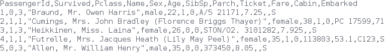

:source-highlighter: coderay
:chapter: 2
:sectnums:
:sectnumoffset: 2
:figure-caption: Figure {chapter}.
:listing-caption: Listing {chapter}.
:table-caption: Table {chapter}.
:leveloffset: 1

= Who did and didn't die on the Titanic

This chapter covers:

- The different concepts we saw in chapter 1 in action: Dataset, Transformer,
Estimator and Pipeline
- Understanding a small dataset in a machine learning context
- Being confronted to a machine learning problem and solving it using Spark ML

Now that we have a broad understanding of Apache Spark and its machine learning
library Spark ML, we're ready to apply those newly-learned concepts to a
small-scale real-world example: the Titanic.

This chapter we'll take you through a Kaggle competition (http://kaggle.com/).
Kaggle is a website hosting machine learning competitions giving away money
prizes or job offers for the very best. They happen to have an introductory
competition about the Titanic (http://kaggle.com/c/titanic) for people
interested in trying their hands at machine learning.

== The problem

For this competition, Kaggle provides a dataset for which each observation
represents a passenger who was on the Titanic:

.A sample of five passengers in the dataset with the corresponding headers

As you can see, we have a few columns at our disposal:

- PassengerId: an identifier for each passenger
- Survived: 1 if the passenger survived, 0 if she / he didn't
- Pclass: the class the passenger was in (1st, 2nd or 3rd)
- Name: the passenger's name
- Sex: Male or female
- Age: the passenger's age
- SibSp: the sum of the number of siblings and spouses onboard
- Parch: the sum of the number of parents and children onboard
- Ticket: an identifier for the ticket
- Fare: the travel fee for this passenger
- Cabin: the cabin in which the passenger was affected
- Embarked: the passenger's port of embarcation (C for Cherbourg in France, S
for Southampton in England, Q for Queenstown in Ireland)

The previous dataset is split in two: one with the Survived column and another
one without. As you might have guessed the task will be to predict if the
passengers in the second dataset survived or not. In other words, predict the
value of the Survived column.

The train.csv file contains our training data which consists of 891 labeled data
points (observations for which we know the value we want to predict: the content
of the Survived column). On the other hand, the test.csv file contains the
unlabeled data we will have to make predictions on, it is made of 418
observations.

The goal will be to leverage the training data to "learn" something about the
passengers. And, as a second step, use what we learned in the first step to
make predictions on our test data.

== Our first machine learning pipeline

We can also reformulate our problem as a classification problem: try to build a
function that given all the information available on a passenger (fare, sex,
port of embarcation, etc) will output one of the two possible classes: the
passenger survived or the passenger didn't survive.

The machine learning library bundled with Spark comes with a wide range of
classification algorithms to pick from. As a result, we'll be able to solve our
problem quite easily.

If you want to follow along, start up your REPL!

=== Loading the data

To solve our problem we first need to get the contents of our train.csv file
into a Dataset. Spark comes with quite a few utilities to read data in
different formats such as CSV, JSON, Parquet into a Dataset.

For the next part, we'll assume that your train.csv file is located at
/data/train.csv:

.Loading our training data into a Dataset using the SparkSession made available in the REPL
[source,scala]
----
val trainFilePath = "/data/train.csv"
val titanicTrain = spark
  .read                          // <1>
  .format("csv")                 // <2>
  .option("header", "true")      // <3>
  .option("inferSchema", "true") // <4>
  .load(trainFilePath)           // <5>
  .cache()                       // <6>
----
<1> We want to read data, as opposed to writing.
<2> As we previously saw, the data is in CSV format.
<3> We specify that the first line won't contain an observation but the names of
each column.
<4> We tell Spark we want it to try to infer the type for every column, if we
don't, it will default to typing every column as a string.
<5> We trigger the loading of the Dataset giving the path where the file is
located.
<6> Since we'll be reusing this Dataset quite a lot to do various operations
it's always a good idea to cache it.

Now that we turned our data into a Dataset, let's see what's inside.

=== Grasping the data

You can have a look at the schema of the data by calling printSchema() on the
Dataset:

.Displaying the schema of the titanicTrain Dataset
[source,scala]
----
titanicTrain.printSchema()

// root
//  |-- PassengerId: integer (nullable = true)
//  |-- Survived: integer (nullable = true)
//  |-- Pclass: integer (nullable = true)
//  |-- Name: string (nullable = true)
//  |-- Sex: string (nullable = true)
//  |-- Age: double (nullable = true)
//  |-- SibSp: integer (nullable = true)
//  |-- Parch: integer (nullable = true)
//  |-- Ticket: string (nullable = true)
//  |-- Fare: double (nullable = true)
//  |-- Cabin: string (nullable = true)
//  |-- Embarked: string (nullable = true)
----

As you can see the schema of our Dataset fits what was in the original file
and each column's type has been correctly inferred.

We can also find out what the first few rows look like by calling show on the
Dataset:

.Peeking what the first 5 rows of our titanicTrain Dataset look like
[source,scala]
----
titanicTrain.show(5)
----

You should get something along the lines of:

.The first 5 rows of our Dataset
[options="header"]
|===
|PassengerId|Survived|Pclass|Name|Sex|Age|SibSp|Parch|Ticket|Fare|Cabin|Embarked
|1|0|3|Braund, Mr. Owen \...|  male|22.0|1|0|       A/5 21171|   7.25|     |S
|2|1|1|Cumings, Mrs. Joh...|female|38.0|1|0|        PC 17599|71.2833|  C85|C
|3|1|3|Heikkinen, Miss. \...|female|26.0|0|0|STON/O2. 3101282|  7.925|     |S
|4|1|1|Futrelle, Mrs. Ja...|female|35.0|1|0|          113803|   53.1| C123|S
|5|0|3|Allen, Mr. Willia...|  male|35.0|0|0|          373450|   8.05|     |S
|===

Looking only at those few records, do you think every column brings valuable
information as to whether this specific passenger survived?

Let's look at the Ticket column first. It seems to be made of a cryptic string
(sometimes) followed by a number which doesn't seem to be normalized (5, 6 or 7
digits in those observations alone). As a matter of fact there are 681 different
ticket numbers for our 891 observations, you can verify that by running:

.Checking the number of distinct tickets
[source,scala]
----
titanicTrain
  .select("Ticket") // <1>
  .distinct()       // <2>
  .count()          // <3>
----
<1> We're only interested in the Ticket column.
<2> We want the distinct ticket numbers.
<3> We want to count the distinct ticket numbers

As you might have expected, there is (almost) one ticket number per passenger.
As a result, as is the Ticket column doesn't give any information about a
passenger survivability. However, we might be interested in deciphering what the
string at the beginning of some tickets means but that's a bit too involved for
an introduction. Hence, I think it's reasonable to get rid of the Ticket column.

With the same rationale, we can eliminate the PassengerId as well. It's even
worse in this case since it's an artificial incrementing id which, most likely,
has been added by Kaggle to evaluate a submission by comparing what we predicted
(survival or death) to what really happened for each passenger (identified by
its id).

Next, the Cabin column: it seems to be composed of the character C followed by
a number, it also appears that it hasn't been filled out for a lot of passengers
(3 out of 5 for this particular sample). We can verify our intuition by
computing the number of observations for which the Cabin column contains an
empty string:

.Computing the number of observations for which the Cabin column is empty
[source,scala]
----
titanicTrain
  .where($"Cabin" === "") // <1>
  .count()                // <2>
----
<1> We're only interested in the records where the Cabin column is empty.
<2> We want to count them.

This gives us 687: almost 4 out of 5 observations. Consequently, we'll remove
this feature from consideration because an empty string in 80% of the passengers
doesn't tell us much about whether or not the passenger survived.

If we follow the same reasoning we applied for the Ticket column, the raw Name
doesn't give us any information about the passenger's survival since there are
as much names as there are passengers (unexpected I know). A more careful
analysis might want to parse the Name column in order to extract the title of
the passenger like Mr., Miss. but there are also, among others, doctors (Dr.)
and colonels (Col.) which might give an idea of the status of the passenger
which might, in turn, influence her / his survivability (e.g. a doctor might be
likelier to survive than a simple gentleman).

We're left with 7 features: Pclass, Sex, Age, SibSp, Parch, Fare and Embarked
and our label column Survived.

=== Filling up the blanks

Focusing on the columns we're actually going to consider to build our model,
it's good practice to do some sanity checks on each of them. Given that, we only
have 7, it's totally manageable to do it "by hand".

Let's start with the Pclass (passenger class) feature. From the description of
the dataset, we expect 3 different values (1 to 3). Let's see if we're in the
right by looking at the unique values the Pclass column can take:

.Checking the distinct values the Pclass column can take
[source,scala]
----
titanicTrain
  .select("Pclass") // <1>
  .distinct()       // <2>
  .show()           // <3>
----
<1> We're only interested in the Pclass column.
<2> We want to check the unique values the column takes.
<3> We want Spark to show them to us.

We get the expected result, let's move on to another feature Sex. By running
the exact same query on the Sex column, we retrieve the results we expected:
female and male. We proceed in the same way to validate the SibSp and Parch
columns, nothing seems to be out of the ordinary for those columns either.

We're left with two columns to investigate: Fare and Age. However, since age and
fare are continous variables they can take a lot of different values which
means we're not gonna be able to apply the same techniques. Fortunately, there
is a nice describe() method which can give a lot of useful information for a
particular continous variable such as its number of non-null entries, its
minimum, mean and maximum values as well as its standard deviation.

Let's see what calling describe() on the Fare columns gives us:

.Calling describe on the Fare column gives us summary statistics
----
titanicTrain
  .describe("Fare") // <1>
  .show()           // <2>
----
<1> We're interested in knowing the summary statistics about the Fare column
<2> We want Spark to show us the results

You should get a Dataset containing the following information:

.Results of calling describe on the Fare column
[options="header"]
|===
|summary|             Fare
|  count|              891
|   mean| 32.2042079685746
| stddev|49.69342859718089
|    min|              0.0
|    max|         512.3292
|===

We can find the number of rows in the dataset for which the Fare is not null in
the first row (count). Since the dataset contains 891 observations, there are no
null fares.
Next, we can see the average Fare which is around 32$ (we'll pretend the fares
are in dollars) which seems fair.

Minimum Fare is 0$ which might be some default value if we don't know what this
passenger paid to get onboard. Another hypothesis might be that the one who
paid 0$ were the crew members but, since the dataset only contains passengers,
we can dismiss it. Plus since it concerns only 15 people we won't give it much
more attention. A more involved analysis might concern itself with this kind of
issue.

At the other end of the spectrum, the maximum Fare is 512$. Here as well, it
appears to be some kind of mistake since the second highest are in the 200$
range. Since there are only 3 people who might have paid 512$, we won't dig
deeper.

Finally, the standard deviation, which, as a reminder, represents the average
distance between the Fare for a particular observation and the mean Fare
(\~32$) is almost 50$ which indicates a skew towards higher fares with certainly
quite a few outliers in the high price ranges influencing the standard deviation
quite heavily.

Even though we have identified a few problems with the Fare column we won't do
much but it's always a good idea to deepen your understanding of a dataset
before actually using it.

We're left with the Age column, if we use the describe method to get a better
understanding of what's going on with this variable, we obtain:

.Results of calling describe on the Age column
[options="header"]
|===
|summary|               Age
|  count|               714
|   mean| 29.69911764705882
| stddev|14.526497332334035
|    min|              0.42
|    max|              80.0
|===

Every statistic seems to be plausible. However we do have a problem with the
number of non-null values which is 714 which is below the number of observations
(891) by quite a great margin (177). This effectively means that 1 out of every
5 passengers doesn't have an age filled out in the dataset. To remedy this
issue, we'll impute a value for the ones that are missing. There exists a few
simple strategies to decide what value to impute: the mean, the median, or the
most frequent (usually used for categorical features). Here, we'll use the mean
which is already in the summary made by the describe method: approximately 29.7
years.

Spark SQL defines two strategies to deal with rows containing null values:
either drop them or replace them by another value. The latter will fit our need
perfectly:

.Replacing null values in the Age column by the column average: 29.7 years
[source,scala]
----
val imputedTrainMap = Map("Age" -> 29.7d)   // <1>
val imputedTitanicTrain = titanicTrain
  .na                                       // <2>
  .fill(imputedTrainMap)                    // <3>
----
<1> We define a map which contains the values we want to use for each column. In
our case we want to replace null values in the Age column by 29.7.
<2> na lets us access functions to work with missing data in our Dataset.
<3> We use the fill method in order to replace missing values according to our
previously defined map.

Our dataset is finally fit to use, we're ready to build our pipeline!

=== Indexing categorical features

Usually the first components in our Pipeline will be Transformers and Estimators
used to fit the data to the format expected by the algorithm we're using. One
such formatting requirement for the algorithm we're going to use is that every
feature should be numerical (no strings allowed) and since we have a couple of
columns containing strings, namely Sex and Embarked, we will have to transform
those into numerical columns.

Fortunately, there exists an Estimator for this use case: StringIndexer.
It will simply add a column to an existing Dataset indexing a column
containing string values. The most frequent values will get the smallest
indices. As an example consider this Dataset which could be a subset of the
Titanic one:

.Example Dataset containing a single Sex column
[options="header"]
|===
|Sex
|male
|female
|female
|male
|female
|===

We have 3 females and 2 males. Thus, if we apply a StringIndexer on the Sex
column we obtain the following Dataset with female getting the 0 index since
it's the most frequent and male getting the 1 index.

.Resulting Dataset of applying a StringIndexer on the Sex column from the previous Dataset
[options="header"]
|===
|Sex|SexAfterStringIndexer
|male|1
|female|0
|female|0
|male|1
|female|0
|===

Now that we understand how a StringIndexer works, we can create one for each
of our problematic columns (Sex and Emabrked):

.Creating two StringIndexers: one for the Sex column and one for the Embarked column
[source,scala]
----
import org.apache.spark.ml.feature.StringIndexer
val stringCols = Seq("Sex", "Embarked")    // <1>
val indexers = stringCols.map { colName => // <2>
  new StringIndexer()                      // <3>
    .setInputCol(colName)                  // <4>
    .setOutputCol(colName + "Indexed")     // <5>
}
----
<1> We define a collection containing the names of the columns which need to be
indexed.
<2> We turn our collection of column names into a collection of StringIndexers.
<3> For each of those column names, we instantiate a StringIndexer.
<4> We specify the name of the column to be indexed.
<5> We specify the name of the column which will be produced by the
StringIndexer.

When we reach this stage in the pipeline, we'll have added two columns
SexIndexed and EmbarkedIndexed containing indices.

=== Assembling the useful features

Another requirement we have to face, which is valid for every machine learning
algorithm in Spark ML, is that all the features have to be squashed together
into a single column containing a vector. Here as well there is a Transformer
which was built for this purpose: VectorAssembler.

It will effectively add a column to an existing Dataset containing a vector
being the concateantion of the values from the specified columns.

For instance, let's consider this synthetic Dataset:

.Dataset containing an Age and a Fare column
[options="header"]
|===
|Age|Fare
|22.0|   7.25
|38.0|71.2833
|26.0|  7.925
|35.0|   53.1
|35.0|   8.05
|===

If we were to apply a VectorAssembler with Age and Fare as input columns, we
would obtain:

.Resulting Dataset of applying a VectorAssembler on the Age and Fare columns from the previous Dataset
[options="header"]
|===
|Age|Fare|OutputOfAssembler
|22.0| 7.25|[22.0, 7.25]
|38.0|71.28|[38.0, 71.28]
|26.0| 7.93|[26.0, 7.93]
|35.0| 53.1|[35.0, 53.1]
|35.0| 8.05|[35.0, 8.05]
|===

Let's define the VectorAssembler we need. As a reminder, we previously selected
the following features: Sex, Embarked, Age, SibSp, Parch, Fare, Pclass.

.Creating our VectorAssembler
[source,scala]
----
import org.apache.spark.ml.feature.VectorAssembler
val numericCols = Seq("Age", "SibSp", "Parch", "Fare", "Pclass")        // <1>
val featuresCol = "features"                                            // <2>
val assembler = new VectorAssembler()
  .setInputCols((numericCols ++ stringCols.map(_ + "Indexed")).toArray) // <3>
  .setOutputCol(featuresCol)                                            // <4>
----
<1> We define the features which are numeric and so don't need to be indexed.
<2> We define the name of the column that will be produced by the
VectorAssembler.
<3> The columns that the assembler will have to take care of are the numeric
columns and the columns results of the StringIndexers.
<4> We specify the name of the column that will be produced by the
VectorAssembler.

Once we get to this stage in the pipeline, we'll have added another "features"
column made of a vector containing the values of the 7 features we want to
consider.

=== Instantiating our algorithm

Now that our data is ready to be fed into a classification algorithm, we can
pick one. For now, consider the chosen algorithm (decision tree) as a black box
Estimator that can make survival predictions from our features. We'll learn what
a decision tree is and how it works in chapter 4.

.Instantiating our classifier
[source,scala]
----
import org.apache.spark.ml.classification.DecisionTreeClassifier
val labelCol = "Survived"                                        // <1>
val decisionTree = new DecisionTreeClassifier()                  // <2>
  .setLabelCol(labelCol)                                         // <3>
  .setFeaturesCol(featuresCol)                                   // <4>
----
<1> We create a labelCol variable to hold the name of the column containing
whether or not the passenger survived also known as the label we're trying to
predict.
<2> We instantiate a DecisionTreeClassifier: the black box that is going to help
us predict whether or not a passenger survived.
<3> We indicate the label we're trying to predict can be found in the Survived
column.
<4> We also specify that the features vector is in the features column.

=== Building the pipeline and the machine learning model

We're now ready to build our Pipeline which will be tying all the components
we just defined together: StringIndexers, VectorAssembler and
DecisionTreeClassifier.

.Creating our Pipeline
[source,scala]
----
import org.apache.spark.ml.Pipeline
val pipeline = new Pipieline()
  .setStages((indexers :+ assembler :+ decisionTree).toArray) // <1>
----
<1> setStages will let us specify the ordering of the components: indexers comes
before assembler since the VectorAssembler assembles the indexed columns and
decisionTree comes last since it uses the output of the VectorAssembler.

If you remember correctly, a Pipeline is an Estimator and calling the fit method
on it will actually trigger the indexing, assembling and learning of the
algorithm that are contained in the Pipeline. This will effectively produces a
Transformer capable of adding a column to a Dataset with the predictions
given by the algorithm or, in other words, a machine learning model.

However, there is still a small requirement we're not meeting: every machine
learning algorithm in Spark ML needs the label column to contain doubles. As is,
the label column (Survived) contains integers as indicated by the printSchema
method on imputedTitanicTrain.

.Casting the Survived column to double
[source,scala]
----
import org.apache.spark.sql.types.DoubleType
val castedTitanicTrain = imputedTitanicTrain
  .withColumn("Survived", $"Survived".cast(DoubleType)) // <1>
----
<1> We're creating a new Survived column result of the casting of the old
Survived column to double.

We're ready to fit our pipeline and build our machine learning model.

.Building our machine learning model
[source,scala]
----
val model = pipeline.fit(castedTitanicTrain)
----

We now have a Transformer ready to be used to make predictions on the test
dataset.

== Solving the Kaggle challenge

In this section, we'll use the previously built machine learning model to
complete the Kaggle challenge:

- Load the contents of the test.csv file
- Make survival predictions for those passengers
- Format our predictions according to the requirements from Kaggle
- Write it to a CSV file
- Submit it on the kaggle.com website

=== Loading the test data

We'll load the test data in the same way we loaded the training data, assuming
it's located at /data/test.csv:

.Loading our test data into a Dataset using the SparkSession made available in the REPL
[source,scala]
----
val testFilePath = "/data/test.csv"
val titanicTest = spark
  .read
  .format("csv")
  .option("header", "true")
  .option("inferSchema", "true")
  .load(testFilePath)
  .cache()
----

This is the exact same sequence of methods we used for the training data so we
won't go in-depth.

You'll notice that this Dataset has the exact same schema compared to
titanicTrain except for the Survived column which is missing from this one.

In the same way we had rows without Age in the training dataset, we have some
also in the test dataset. However, in this dataset, we have one row without
Fare which you can see with:

.Obtaining the row without Fare in the test Dataset
[source,scala]
----
titanicTest
  .where($"Fare".isNull) // <1>
  .show()                // <2>
----
<1> We filter the Dataset to obtain only the rows where the Fare column is null.
<2> We want to display the resulting Dataset.

As a result, we'll have to provide a default Fare value for this Dataset in
addition to the one for the Age column. If we go back to our investigation of
the Fare column, we had determined that the average fare for the training
dataset was approximately 32.20$. We'll use this value in the row missing a Fare
value:

.Replacing null values in the Age and Fare column in the test Dataset
[source,scala]
----
val imputedTestMap = imputedTrainMap + ("Fare" -> 32.2d) // <1>
val imputedTitanicTest = titanicTest
  .na                                                    // <2>
  .fill(imputedTestMap)                                  // <3>
----
<1> We add to the existing map containing an imputed value for the Age, a
replacement value for the Fare column.
<2> As before, na lets us access functions to work with missing data.
<3> We replace missing values in the Age and Fare columns according to our map.

=== Making predictions

Since our test Dataset doesn't contain null values anymore, we can safely use
the model we built in the preceding section to make predictions.

.Using the model to make predictions on the imputedTitanicTest Dataset
[source,scala]
----
val predictions = model.transform(imputedTitanicTest) // <1>
----
<1> The model built is a Transformer so we can call the transform method on it.
It will add predictions to the Dataset.

If you inspect the schema of the predictions Dataset, you'll see that the model
Transformer added 3 columns (excluding the ones created by the StringIndexers
and the VectorAssembler):

- rawPrediction which contains a vector of length 2 (one element for each class
in our problem: did not survive and survived). The values inside this vector
corresponds to a score produced by the algorithm. Since we're treating our
classification algorithm as a black box, we won't explain what those values
mean. Just know the highest value's index will be the predicted label. For
instance, if we have \[361.0, 41.0\], the label 0 (didn't survive) will be
predicted.
- probability which also contains a vector of length 2 (one element for each
class) containing the probability of each predicted label. It is a normalization
of the rawPrediction column according to a probability distribution (here
multinomial). In practice, if we take back our example content in the
rawPrediction column \[361.0, 41.0\], the content of the probability column
can be computed as \[361.0 / (361.0 + 41.0), 41.0 / (361.0 + 41.0)\] \~=
\[0.90, 0.10\].
- Last but not least the prediction column which contains the predicted label: 0
if the algorithm classified the passenger as not a survivor and 1 otherwise.

For our particular problem, only the prediction column will be useful.

We have now successfully predicted whether or not every passenger in the test
dataset survived.

=== Writing our results

We can now write our predictions to a csv file following Kaggle's requirements.
Our file should contain only two columns: PassengerId and Survived (our
predictions).

Remember however that algorithms inside Spark ML know how to deal
with only double labels and Kaggle expects our Survived column to contain
integers (0 for death, 1 for survival). As a result, we'll have to cast back
our double predictions to integers.

We'll write our result to the /data/result.csv path.

.Writing our predictions according to Kaggle's formatting guidelines
[source,scala]
----
import org.apache.spark.sql.types.IntegerType
val outputPath = "/data/result.csv"
predictions
  .select($"PassengerId", $"prediction".cast(IntegerType).alias("Survived")) // <1>
  .coalesce(1)                                                               // <2>
  .write                                                                     // <3>
  .format("csv")                                                             // <4>
  .option("header", "true")                                                  // <5>
  .save(outputPath)                                                          // <6>
----
<1> We keep only the columns we need: PassengerId and prediction which we cast
to integer and rename to Survived.
<2> By default, Spark will write a file per partition. Here, we put everything
in a single partition so only a single file is created.
<3> We want to write (as opposed to read) our Dataset to disk.
<4> Kaggle wants a CSV file so we oblige.
<5> We also comply to the first line containing headers requirement.
<6> save will actually trigger the writing.

After running this piece of code you should get two files in the
/data/result.csv/ folder:

- An empty file named _SUCCESS indicating that the operation was a success
- A file with the actual content named
part-r-[0-9]\{5\}-deadbeef-dead-beef-dead-beef-dead-beef.csv which is a naming
convention inherited from Hadoop. It contains the id of the partition (in our
case 0) and a random universally unique identifier (UUID).

If you look at the beginning of the part file you should see something like:

.The first 5 lines of the part file
[options="header"]
|===
|PassengerId|Survived
|892|0
|893|1
|894|0
|895|0
|896|1
|===

Which fits what Kaggle expects.

=== Submit

We're ready to submit the file, head over to
https://www.kaggle.com/c/titanic/submit (you need to create an account to
submit your solution for evaluation) and submit your CSV file.

I got a score of xxx which you should get too since the algorithm we used is
deterministic (TO VERIFY).

== Summary

In only 94 lines of code, we were able to solve a machine learning problem and
we managed to learn a lot along the way.

We now have seen the major concepts exposed in chapter 1 in action such as
Datasets, Transformers and Estimators.

We've seen how we could combine and sequence those Transformers and Estimators
into a single Pipeline.

Most importantly, we have had the chance to express fairly complex ideas like
solving a classification problem in very simple terms which is where lies the
value of the Spark ML library.

Can you beat the xxx score we got?

One thing we could try is to change the algorithm we used for another
classification algorithm available in Spark. You can find a list in the Spark
documentation at
http://spark.apache.org/docs/latest/ml-classification-regression.html#classification.

We also could enrich our initial dataset by adding features to it. One simple
feature to add would be the family size of each passenger. Knowing that you
can add a feature NewFeat sum of two existing features Feat1 and Feat2 like
that:

.Creating a new column sum of two existing ones in a Dataset
[source,scala]
----
val newDataset = oldDataset.withColumn("NewFeat", $"Feat1" + $"Feat2")
----

How would you go about it?

.Answer
[source,scala]
----
val newTraining = titanicTrain.withColumn("FamilySize", $"SibSp" + $"Parch" + 1)
val newTest = titanicTest.withColumn("FamilySize", $"SipSp" + $"Parch" + 1)
----

On the subject of checking the integrity of the data, how would you check that
there are as many passengers as there are names in the titanicTrain Dataset?

.Answer
[source,scala]
----
titanicTrain.count() == titanicTrain.select("Name").distinct().count()
----

Suppose that, to satisfy you curiosity, you want to know how many passengers
supposedly paid 0$ (since we have no way of knowing if they actually paid 0$ or
if there is a mistake in the dataset).

.Answer
[source,scala]
----
titanicTrain.where($"Fare" === 0).count()
----

Can you think of an algorithm to extract the title from the Name column?

That's it for chapter 2 which, I hope, gave you a glimpse of the power of the
Spark ML API.
