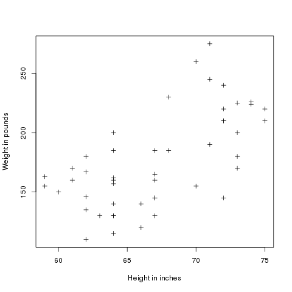
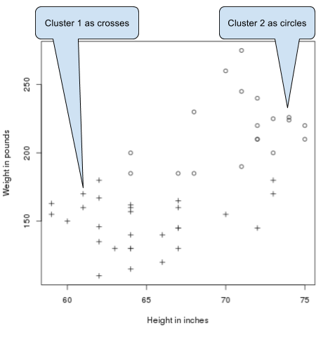
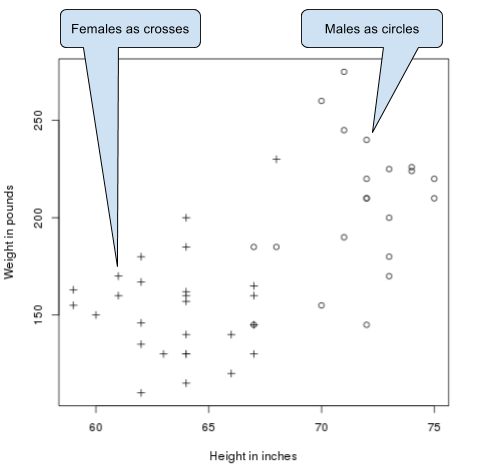

:source-highlighter: coderay
:chapter: 4
:sectnums:
:sectnumoffset: 2
:figure-caption: Figure {chapter}.
:listing-caption: Listing {chapter}.
:table-caption: Table {chapter}.
:leveloffset: 1

= Clustering GitHub users

This chapter covers:

- What is clustering and what is it for?
- Understanding the K-means algorithm and its distributed variant
- Transforming our raw data into properly formatted data
- Building a machine learning pipeline using the K-means algorithm
- Tuning it to get the best results possible

Imagine you're working for GitHub and were put in charge of finding the users
who might be most tempted by a new offering: 50% discount on the fee for private
repositories for new paying users. Take a second to think about how you would
find those users.

Should we target power users? How do we define a power user? By setting a lower
bound on an arbitrary metric like the number of commits per month? If the bound
is too low we'll bother people who were never interested by the offer, if too
high we'll limit the impact of our campaign. What if I'm the CEO of a small
company developing, for now, open source products and, being the main contact
with our customers, I report their problems to the dev team by logging issues
into GitHub, am I not someone who might be interested by the offer?

A lot of questions, a lot less answers.

Thankfully clustering will solve our issues.

== Clustering

The goal of clustering is to gather elements sharing some similarities under a
cluster. The elements inside a cluster are supposed to be more similar to each
other than to elements coming from other clusters. Ideally, in our case, we
would have two clusters: the users who might be interested in our offer on one
side and the others on another side. In practice, this won't be that easy
unfortunately.

As an example, we randomly sampled 50 people from the 2015 NHIS (National Health
Interview Survey) designed by the United States' CDC (Centers for Disease
Control and Prevention). The whole dataset can be obtained on the CDC's website
(http://www.cdc.gov/nchs/nhis/index.htm). We then plotted their height and
weight:

.Heights and weights of 50 randomly sampled people from the 2015 NHIS

Using those heights and weights, we split our data into two clusters using a
clustering algorithm we'll detail in the next section:

.Heights and weights of 50 randomly sampled people from the 2015 NHIS separated into 2 clusters. The elements belonging to the first cluster are denoted by crosses, those belonging to the second are represented as circles.

We have effectively discovered new information: we've separated the sample into
two categories. However, we don't know what those categories correspond to. It
turns out they fit rather well the sex of the person:

.Heights and weights of 50 randomly sampled people from the 2015 NHIS. Females are represented as crosses and males as circles.

By clustering only the initial data (heights and weights of people) we managed
to uncover their sex.

However, one question remains: how did we build the clusters?  That's what we'll
find out in the next section.

== The K-means algorithm
