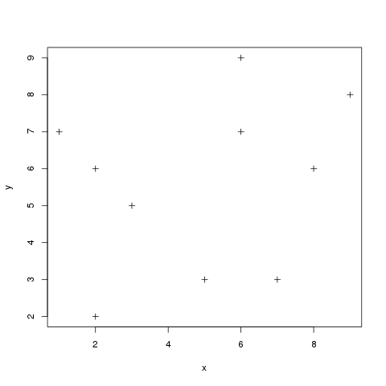
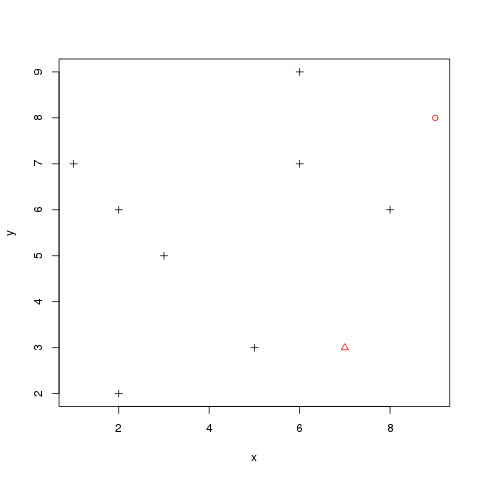
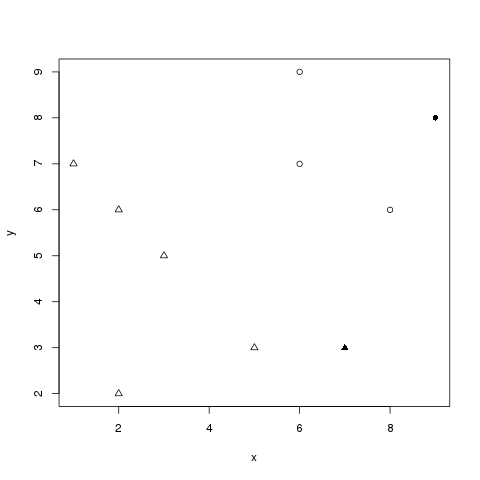
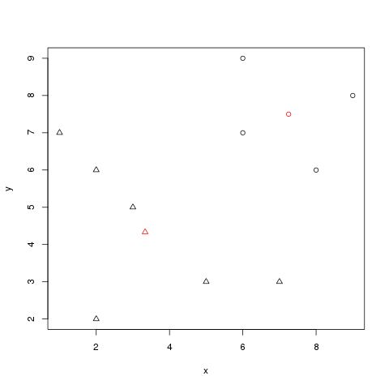

:source-highlighter: coderay
:chapter: 4
:sectnums:
:sectnumoffset: 2
:figure-caption: Figure {chapter}.
:listing-caption: Listing {chapter}.
:table-caption: Table {chapter}.

= Clustering GitHub users

This chapter covers:

- What is clustering and what is it for?
- Understanding the K-means algorithm and its distributed variant
- Transforming our raw data so we can use a clustering algorithm
- Building a machine learning pipeline using the K-means algorithm
- Tuning it to get the best results possible

Imagine you're working for GitHub and were put in charge of finding the users
who might be most tempted by a new offering: 50% discount on the fee for private
repositories for new paying users. Take a second to think about how you would
find those users.

Should we target power users? How do we define a power user? By setting a lower
bound on an arbitrary metric like the number of commits per month? If the bound
is too low we'll bother people who were never interested by the offer, if too
high we'll limit the impact of our campaign. What if I'm the CEO of a small
company developing, for now, open source products and, being the main contact
with our customers, I report their problems to the dev team by logging issues
into GitHub, am I not someone who might be interested by the offer?

A lot of questions, a lot less answers.

Thankfully clustering will solve our issues.

== Clustering

The goal of clustering is to gather elements sharing some similarities under a
cluster. The elements inside a cluster are supposed to be more similar to each
other than to elements coming from other clusters. Ideally, in our case, we
would have two clusters: the users who might be interested in our offer on one
side and the others on another side. In practice, this won't be that easy
unfortunately.

As an example, we randomly sampled 50 people from the 2015 NHIS (National Health
Interview Survey) designed by the United States' CDC (Centers for Disease
Control and Prevention). The whole dataset can be obtained on the CDC's website
(http://www.cdc.gov/nchs/nhis/index.htm). We then plotted their height and
weight:

.Heights and weights of 50 randomly sampled people from the 2015 NHIS
image::../images/before.png[]

Using those heights and weights, we split our data into two clusters using a
clustering algorithm we'll detail in the next section:

.Heights and weights of 50 randomly sampled people from the 2015 NHIS separated into 2 clusters. The elements belonging to the first cluster are denoted by crosses, those belonging to the second are represented as circles.
image::../images/kmeans.png[]

We have effectively discovered new information: we've separated the sample into
two categories. However, we don't know what those categories correspond to. It
turns out they fit rather well the sex of the person:

.Heights and weights of 50 randomly sampled people from the 2015 NHIS. Females are represented as crosses and males as circles.
image::../images/real.png[]

By clustering only the initial data (heights and weights of people) we managed
to uncover their sex.

However, one question remains: how did we build the clusters? That's what we'll
find out in the next section.

== The K-means algorithm

K-means is one of the most widely known and used clustering algorithm because,
as we'll see, it is fairly easy to understand and it has good performance given
a bit of domain-specific knowledge. As a result, K-means is supported by Spark
ML amongst other clustering algorithms.

At a high level, K-means starts with _K_, a number chosen by the user of the
algorithm, "random clusters" and, iteration after iteration, refines those
clusters until some stopping criteria are reached.

=== Choosing K

CHECK ADV

=== Flow of the algorithm

Next up, we are going to describe a typical starting cycle for the K-means
algorithm.

We start with a dataset for which we know nothing about and _K_, the number of
clusters we want to obtain.

Following is a synthetic dataset containing 10 data points we are going to work
with throughout the explanation:

.10 synthetic data points used to illustrate our point

We then randomly choose _K_ (in our case 2) data points from the dataset and
pick them as our initial centroids (center of our cluster):

.10 synthetic data points from which we randomly selected two to serve as our initial centroids colored in red (a circle for the first cluster, a triangle for the second)

Once this is done, we repeat the following process.

We compute, for every point, the distance from the point to each centroid. We
affect a cluster depending on the closest centroid, as shown in the next plot:

.10 synthetic data points for which we assigned a cluster based on the closest centroid. The centroid are in red and the "normal" points are in black. The points belonging to the first cluster are represented as circles and those belonging to the second cluster as triangles.

Finally, we compute new centers, which are not part of the original dataset, for
each cluster by averaging the positions of all points belonging to a cluster:

.10 synthetic data points for which we computed centroids by averaging the position of each data point belonging to the cluster. The new centers are colored in red.

The last two steps describe a typical iteration: affecting clusters to data
points and computing new centroids. This process is repeated until some stopping
conditions are met which will be detailed in the next section.

Note that small variations exist for the K-means algorithms such as TO COMPLETE

=== Stopping conditions

=== Distributed
