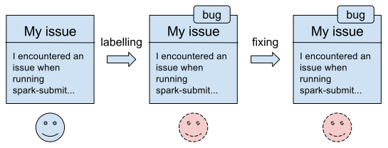
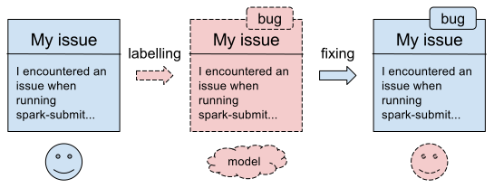
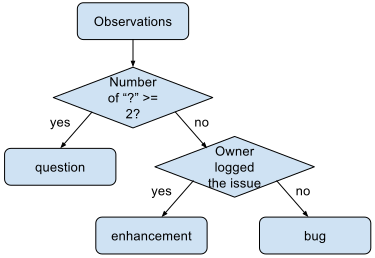
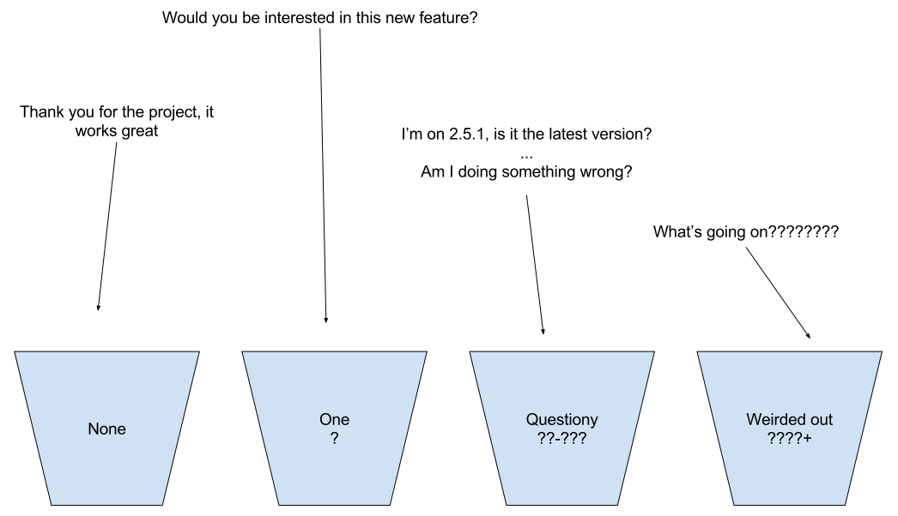
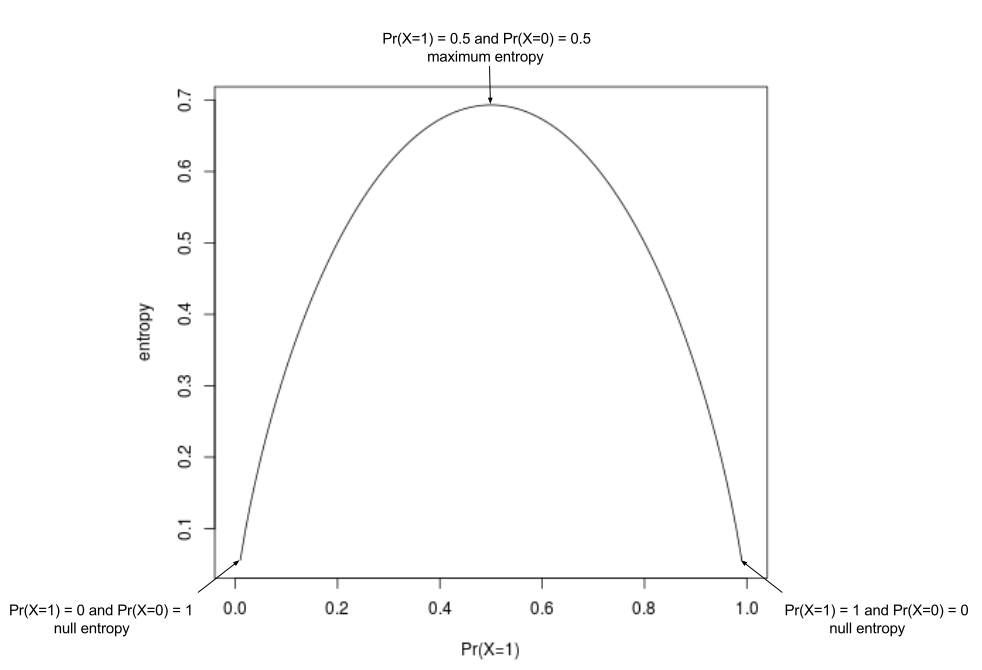
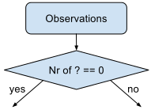
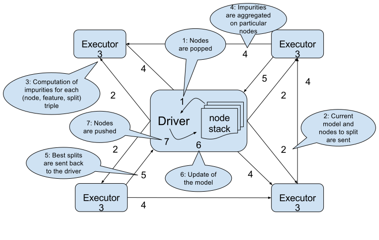
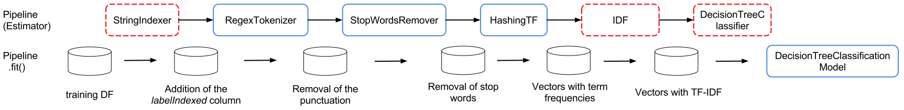
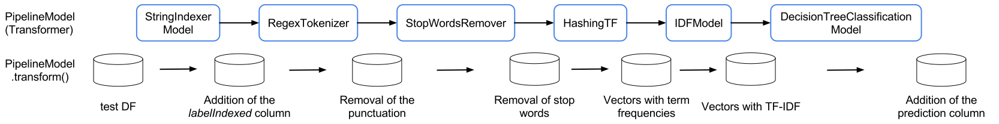

:source-highlighter: coderay
:chapter: 4
:sectnums:
:sectnumoffset: 2
:figure-caption: Figure {chapter}.
:listing-caption: Listing {chapter}.
:table-caption: Table {chapter}.
:leveloffset: 1

= Triaging GitHub issues using a decision tree

This chapter covers

- Classification and how it is used
- Understanding what a decision tree is and how it works in a distributed
fashion
- Transforming raw data to use a decision tree
- Tuning our model to get the best results possible

In this chapter, we will use Spark ML to try to ease the maintenance burden of
open source projects on GitHub by building a machine learning model that will be
able to find the most appropriate label for an issue.

Put simply, the goal is to alleviate the overhead maintainers face when
dealing with an incoming GitHub issue. Usually, a user of a project hosted on
GitHub logs an issue, which is then read once by the maintainer who labels it
appropriately. When the maintainer has enough time to spend on this particular
issue, she will have to become familiar with the issue again to solve it.
Frequently, maintainers skip the first step; and as a result the labelling
feature On GitHub goes unused. We're going to try and solve this issue with
machine learning, so that if a maintainer has only enough time to answer a
question, he can look directly at the issues that are labeled "question" by our
model.

In figures 4.1 and 4.2 we can visualize the value of the machine learning model
we have yet to build.

.The current workflow when logging an issue on GitHub.

The user (the solid-lined smiley) comes in and logs the issue, this issue is
labeled by the maintainer represented as a dashed-line smiley, it's then fixed
by this same maintainer.

.The workflow we're aiming for when logging an issue on GitHub.

Our model, in the dashed cloud, will be in charge of the labelling now in dashed
lines. The fixing of the issue will still be taken care of by the maintainer
because machine learning models can't fix bugs, yet.

We'll limit the model to predicting three labels question,
enhancement, and bug because they are present by default when you create a
repository on GitHub and are the most commonly used as we'll see when we'll
investigate the data.

== Classification

In machine learning terms, we want to build a model that is able to predict the
most appropriate issue label (our label) given the text contained in the issue
(our features).

This is a supervised learning problem (as in chapter two) because it builds a
function that takes the text of the issue as input and outputs a label
(question, bug, or enhancement).

Because the set of possible values our function can produce is finite
(bug, question or enhancement) this also is a classification problem.

There exists many classification algorithms out there many of which are
supported by Spark ML but, in this chapter, we're going to focus on one of the
most fundamental: decision trees.

== The decision tree algorithm

You might have used decision trees or flowcharts outside of a machine learning
context in the past as they are a fairly popular tool to model a troubleshooting
process, or complex nested if statements (we've all encountered those,
unfortunately).

It turns out that decision trees can also be used as a machine learning models
either for classification or regression. In the case of classification, the
leaves of the tree represent possible values the label can take whereas the
internal nodes are decisions made on a feature that tries to improve our
classification.

Decision tree models can easily be represented as flowcharts.
For example, we could imagine a very simple classification model for our problem
of classifiying GitHub such as the decision tree shown in figure 4.3.

.A very simple decision tree to tell the label of a GitHub issue.

Our simple decision tree predicts that an issue should be labeled as a question
if there are more than two question marks in the body of the issue. If not, it
should be labeled according to the author of the issue. If the author is the
owner of the repository, our model will output that the label should be
enhancement. Otherwise, it'll be labelled as a bug.

When we want to know what the decision tree would predict for a new observation,
we just give this observation as input to the root of the tree and we follow
along the decisions according to the values of the features for this new
observation.

Obviously, the decision tree learning algorithm leverages all the features made
available to it (like the text itself) and, as a result, will contain much more
than two decision nodes. That's what we'll study next.

=== Decision tree learning

The "model" we just built relied on our own simple heuristic; however, we
still don't know how a decision tree classifier might arrive at this result (or
a far better one).

The process of learning, or building the decision tree, can
be broken down as the following process: finding the best decision to make from
the current set of observations, deciding if this decision has to be turned into
a decision node or a leaf node according to a few criteria. If we choose to
create a decision node, we go back to the "finding the best decision" step until
we're left with only leaves.

Each best decision corresponds to a binary split of the dataset according to a
feature value. Intuitively, the best decisions are the ones that most
discriminate examples with respect to the class: a decision that split a dataset
in two where each example in each subset has the same class tends to be an
extremely good decision.

If we go back to our simple decision tree, we've first estimated that the best
decision to make was to split our initial dataset in two according to the number
of question marks feature: the issues that had more than two question marks on
one side and those that had less or equal to two on the other. We then assumed,
for the issues containing more than two question marks that the split was
satisfactory and that we could create a leaf node containing the question label.
We then turned our attention to the issues that had less or equal to two
question marks. We chose to split them according to the author of the issue:
whether it was the owner of the repository or not. Finally, we deemed both
resulting sets of issues (issues with less than two question marks and for which
the author was the owner on one side and those for which the author wasn't the
owner) satisfactory with respect to our yet-to-be-defined criterion and created
leave nodes with the enhancement and bug labels respectively.

We've just scratched the surface of how the algorithm works, we'll now detail
each of those steps in turn to gain a deeper understanding of how it behaves.

=== Bucketing

One step we didn't mention earlier is bucketing. All the features of our dataset
are bucketed or binned. The need for this step arises from the fact that there
are as many ways to split an ordered set of values in two as there are values.
This is a problem when it comes to features with high arities such as continuous
features where there can be as many different values as there are observations.
Because one way to split a set of values a feature can take in two directly
translates into a possible decision we could make and because we need to make
the best of those decisions we need to evaluate every one of them. As you might
sense this quickly becomes intractable if there are too many possible decisions
to evaluate and bucketing those features solves that.

An example of a continuous feature with high-arity would be the number of words
contained in a GitHub issue. We directly notice that the raw number wouldn't
really be useful, buckets such as short, medium-sized and large would be better.
There can also be discrete features with high-arity such as which repository the
issue belongs to.

Now that we understand why this process is necessary, we'll get into how each
feature is binned by Spark ML according to its type.

For categorical features, like the author of the issue, there is usually one bin
for every value the feature can take. Here, this would result in three bins:
owner, contributor and visitor (didn't contribute to the project in the past).

For continuous features, bins calculations are done on a randomly-chosen sample
of data. For each feature, if there are less distinct values, in this sample,
than a preset maximum number of bins (called `maxBins`), there will be
one bucket per distinct value. However, if there are more distinct values than
maxBins, maxBins buckets will be built so that the sampled data is more or less
uniformly distributed across those buckets. If we go back to our example, the
bucketing of the number of question marks feature could result in: none (0),
random question appears (1), questiony (2-3), weirded out about the behavior of
something (4+) if maxBins = 4 and assuming the number of question marks follows
a uniform distribution across those buckets.

The bucketing of a few issues is shown in figure 4.4.

.The process of bucketing issues according the number of question marks feature.

Note that this process is done only once at the start of the algorithm.

=== Finding the best decision

Once those buckets are built, we'll try to recursively find the best split,
which can be thought of as the best decision we can make about classifying our
observations, across all features.

Intuitively, how would you measure the performance of a decision? In decision
trees, this is done by comparing the subset of data before the decision and the
subsets produced by the decision. Does our decision advance the classification
process? In other terms, does our decision produce subsets of data where the
class is more homogeneous than what was before the decision?

Ideally, when running down our decision tree with an example to classify, we'd
arrive at a leaf node predicting the correct class. This is influenced by the
fact that, when building our decision tree, we had as many examples falling into
this leaf with this correct class as possible.

To formalize those ideas, we'll define a few concepts next.

==== Purity / impurity

To measure how homogeneous a dataset is with regards to its class, we will
define purity. A pure dataset contains examples that all belong to the same
class. For example, a subset of the GitHub issues which have all been labeled
question would be pure. Conversely, a dataset is impure if it contains examples
that don't belong to the same class. In practice, this is not a binary (pure or
impure) process as we can measure the impurity of a dataset by looking at the
different proportions of examples belonging to each class.

There exists two strategies to measure the impurity of a dataset: Gini impurity
and entropy.

==== Gini impurity

According to Wikipedia, Gini impurity measures "how often a randomly chosen
element from the set would be incorrectly labeled if it was randomly labeled
according to the distribution of labels in the subset". Hard to grok, isn't it?
Defining it in mathematical terms and walking through an example will make
everything clearer.

For a subset with _J_ classes, _i ∈ 1, 2, ... J_ being the _i^th^_ class and
_f~i~_ being the fraction of examples labeled with the _i_ class, it's defined
as:

latexmath:[$Gini \: impurity = 1 - \sum_{i=1}^J f_i^2$]

We see that, for a pure dataset (every example belonging to the same class), we
get an impurity of 0.

Let's walk through an example with a fictious dataset of GitHub issues with
fictious features in table 4.1.

.Example dataset of ten GitHub issues described with their number of question marks and author type.
[options="header"]
|===
 2+^.^h|Features|Class
|Number of ?|Author type|Label
|1|Owner|Enhancement
|1|Owner|Enhancement
|1|Visitor|Question
|0|Visitor|Bug
|1|Visitor|Question
|0|Visitor|Bug
|0|Owner|Bug
|0|Visitor|Enhancement
|1|Contributor|Enhancement
|0|Visitor|Bug
|===

Because four out of ten issues have the Enhacement label, two have the Question
label and four have the Bug label , we get the following impurity:

latexmath:[$Gini \: impurity = 1 - (\frac{4}{10}^2 + \frac{4}{10}^2 + \frac{2}{10}^2) = 0.64$]

Because, we're looking for a pure subset, we'd like the Gini impurity to be zero.

==== Entropy

We can also measure the purity of a dataset by computing its entropy. The notion
of entropy used here comes from the information theory field. Although a full
explanation is out of the scope of this book, it's good to know however how it
works in the case of two classes.

Let's take the example of two classes 1 and 0, the entropy as a function of the
probability that the class associated to an example is 1 (Pr(X=1)) is shown
in figure 4.5.

.Entropy as a function of Pr(X = 1).

Note that, because we have two classes, Pr(X = 0) + Pr(X = 1) = 1.

As we can see, it's at its maximum when Pr(X = 1) is at 0.5 (and consequently
Pr(X = b) = 0.5 too) which means maximum impurity: equal probability of the
class being either 1 or 0. It's at its minimum when either Pr(X = 1) = 0
(Pr(X = 0) = 1) or Pr(X = 1) = 1 (Pr(X = 0) = 0) which means complete purity.

As a result, we will look for low entropies when evaluating the purity of a
subset of data.

It can be generalized for _J_ classes and computed as:

latexmath:[$Entropy = - \sum_{i = 1}^J f_i \times log_2(f_i)$]

If we compute the entropy of our example dataset in table 4.1, we have:

latexmath:[$Entropy = - (\frac{4}{10} \times log_2(\frac{4}{10}) + \frac{4}{10} \times log_2(\frac{4}{10}) + \frac{2}{10} \times log_2(\frac{2}{10})) = 1.52$]

==== Information gain

Now that we understand the two strategies used to measure the purity of a
subset, we can tackle the problem of evaluating decisions. We'll do so by
defining information gain which can be grokked in simple terms by: are the
subsets my decision produced purer that the subset I had before the decision.
Information gain relies on a strategy for measuring purity such as Gini or
entropy.

It can be measured as the difference between the purity of the parent subset
and the weighted sum of the purity of the two children.

latexmath:[$Information \: gain = purity \: metric \: of \: the \: parent - \sum purity \: metrics \: of \: the \: children$]

If we go back to our simple decision tree repeated in figure 4.6.

.A very simple decision tree to predict the label of a GitHub issue.

Are the two subsets produced by our first decision (issues with less than two
question marks on one side and the rest on the other side) more homogenous with
regards to the class (the label of the issue) than the one we had before the
decision (every single example because it was the first decision node we built).

The best decision will be the one with the highest information gain.

Now that we have the tools to find the best decision we can make, we need to
find whether it's worth continuing the branch of the tree by creating a decision
node or if we're better off stopping the branch here and creating a leaf node.

=== Decision node or leaf node?

When determining the type of node we need to construct (leaf or decision), there
are multiple parameters we need to take into account.

==== Information gain threshold

If the information gain for the best split we just computed is inferior
to some threshold, we'll create a leaf node with the most common label
in the data that arrived to this node.

This threshold is here to try to keep the decision tree simple. Indeed, it's is
useless to keep creating decision nodes if we don't gain any information, we
might as well create a leaf node and call it a day.

==== Minimum number of instances

If there are less than a predefined number of observations falling into
either child produced by a decision node, we'll turn this node into a leaf node
containing the most common label among those observations.

Here as well, the goal is to keep the decision tree simple. It's not worth the
effort of creating decision nodes if the decision produce a child with only one
observation. Even though it might be the best decision possible, it will over
complicate the model for simply no benefits.

For example, if we fix this minimum number of observations to 100 and there are
only eight issues with more than two question marks we create a leaf node. Let's
say that among those 100 issues, 52 have the Question label, the leaf node
will accordingly contain the Question label.

==== Maximum depth of the decision tree

If the depth of the decision node produced exceeds the predefined maximum
depth of the tree, a leaf node is created with the label which has the majority.

.Depth of a tree.
****
If you're feeling rusty regarding data structures, the depth of a tree is
defined as the biggest length of the path from a leaf to the root of the tree.

Our example decision tree has a depth of two with the root being the first
decision node (Number of "?" >= 2) and the farthest leaves being the enhancement
and bug nodes.
****

==== Every example has the same class

If all the examples coming out of the best decision have the same class,
we'll create a leaf node with this class.

For example, if all issues having more than or equal to two question marks have
the question label, we can stop our investigation right here and create a leaf
node with the quesiton label.

==== Otherwise leaf node

If none of those criteria are met, we create a decision node and not a leaf
and we go back to finding the best decisions for the subsets our decision node
just created.

=== Stopping criterion

Our tree is finished once the leaves of our tree are leaf nodes (where a class
is affected). In other words, there are no decisions left that need evaluation.

=== Building our first decision node

Now that we have all the tools let's build the first node of a decision tree if
we were to build a classifier for the dataset in table 4.2.

.Example dataset of ten GitHub issues described with their number of question marks and author type.
[options="header"]
|===
 2+^.^h|Features|Class
|Number of ?|Author type|Label
|1|Owner|Enhancement
|1|Owner|Enhancement
|1|Visitor|Question
|0|Visitor|Bug
|1|Visitor|Question
|0|Visitor|Bug
|0|Owner|Bug
|0|Visitor|Enhancement
|1|Contributor|Enhancement
|0|Visitor|Bug
|===

As we've just seen, the Gini impurity for this dataset is 0.64 and its entropy
is 1.52.

Now, we have to evaluate every possible split of our two features (number of
question marks and author type). Let's start with the number of question marks
feature, because this feature takes only two values in our dataset, there is
only one possible split: zero question marks on one side and 1 question mark on
the other side. The resulting subsets are detailed in table 4.3 and 4.4.

.Split of the example dataset on number of question marks when it's 0.
[options="header"]
|===
|Number of ?|Label
|0|Bug
|0|Bug
|0|Bug
|0|Enhancement
|0|Bug
|===

For brevity, we only kept the feature we're splitting on (here number of
question marks) and the class (Label).

If we compute the Gini impurity for this subset we'd obtain:

latexmath:[$1 - (\frac{4}{5}^2 + \frac{1}{5}^2) = 0.32$]

Same goes for the entropy:

latexmath:[$-(\frac{4}{5} \times log_2(\frac{4}{5}) + \frac{1}{5} \times log_2(\frac{1}{5})) = 0.72$]

Because there are no issues labeled questions in this subset we omit it from our
calculations.

From now on, we won't detail the calculations.

The other split (the dataset containing the issues with 1 question mark) can be
found in table 4.4.

.Split of the example dataset on number of question marks when it's 1.
[options="header"]
|===
|Number of ?|Label
|1|Enhancement
|1|Enhancement
|1|Question
|1|Question
|1|Enhancement
|===

The Gini impurity for this dataset is 0.48 and the entropy is 0.97.

Now that we have the impurity measurements before the split and after, we can
compute the information gain for this split. We note information
gain IG(Nr?) the information gain on the number of question marks feature for
our particular dataset as follows:

latexmath:[$IG_{gini}(Nr?) = 0.64 - (\frac{5}{10} \times 0.32 + \frac{5}{10} \times 0.48) = 0.24$]

latexmath:[$IG_{entropy}(Nr?) = 1.52 - (\frac{5}{10} \times 0.72 + \frac{5}{10} \times 0.97) = 0.68$]

We effectively subtract the impurities of the children from the one of the
parent. As its name implies we're looking for the highest information gain.

Let's move on to the author type feature and let's split on it. Those splits
can be seen in table 4.5, 4.6 and 4.7.

.Split of the example dataset on author type with owner only.
[options="header"]
|===
|Author type|Label
|Owner|Enhancement
|Owner|Enhancement
|Owner|Bug
|===

The Gini impurity for this subset is 0.44 and its entropy 0.92.

.Split of the example dataset on author type with visitor only.
[options="header"]
|===
|Author type|Label
|Visitor|Question
|Visitor|Bug
|Visitor|Question
|Visitor|Bug
|Visitor|Enhancement
|Visitor|Bug
|===

The resulting Gini impurity is 0.61 for this dataset. Its entropy is 1.46.

.Split of the example dataset on author type with contributor only.
[options="header"]
|===
|Contributor|Enhancement
|===

Here, both Gini impurity and entropy equal zero because the dataset is pure (all
examples belong to the same class).

If we compute the information gain with the two impurities we get:

latexmath:[$IG_{entropy}(author \: type) = 0.64 - (\frac{3}{10} \times 0.44 + \frac{6}{10} \times 0.61 + \frac{1}{10} \times 0) = 0.14$]

latexmath:[$IG_{gini}(author \: type) = 1.52 - (\frac{3}{10} \times 0.92 + \frac{6}{10} \times 1.46 + \frac{1}{10} \times 0) = 0.37$]

We now know that the best split is based on the number of question marks because
it has the highest information gain. The resulting node is shown in figure 4.7.

.The first decision node in our decision tree

This process continues for each resulting subset until we reach one of the
leaf conditions we listed earlier. Finishing building the decision tree is given
as an exercise.

Now that we understand how to build a decision tree on a small dataset, let's
see how it works with distributed data inside Spark ML.

== The distributed decision tree algorithm

During initialization, the continuous features are binned using a sample of the
distributed data following the same process we described during our explanation
of local decision trees.

Next, we'll describe a typical cycle of a distributed decision tree as it is
implemented in Spark ML using the schema in figure 4.8.

.A cycle in the distributed decision tree algorithm in Spark ML.

The stack (the LIFO data structure) of nodes being maintained on the driver
contains the list of nodes in our decision tree that need splitting. When the
algorithm starts, we only need to split the root containing all the
observations.

The first step will be to pop some nodes for splitting. The number of nodes
popped depends on an estimation of how much memory will be needed to compute
information gain for this node.

When the nodes have been selected, they are sent to the executors for
distributed evaluation. The current decision tree model containing the splits
that have been built so far is also sent. For the first iteration, this model
only contains the root node. This process is denoted as step two in the schema
in figure 4.8.

For each node received, impurity calculations are done for each (feature, split)
combination possible on the executors. Those calculations are done on the
partition of data available on this executor. This step (the third in the schema)
is analogous to what we've done in the example on how to build a decision node.
If we go back to this example, we could imagine having received the root node to
split (which has every observation) and having access to only those ten
examples, we subsequently tried to split the dataset in every kind of way
according to its features (number of question marks and author type) and its
corresponding splits (1/0 for the number of question marks,
owner/contributor/visitor for the author type), for each of those combinations
we computed the impurity of the resulting subsets.

What we haven't done yet is computing information gains. To do this we need to
have all the impurities corresponding to a (node, feature, split) triple
accessible on a node. As a result, we're sending the impurities for every
combination on particular nodes to be aggregated in step four. This is done
thanks to a reduce operation where the key is the (node, feature, split)
triple (all impurities for this triple will land on the same node) and the
impurities are aggregated together. This is represented by step four
in the schema where impurities are sent across the different nodes based on
their key. Because all impurity stats for a triple is present on some single
node as well as the current model, the information gain is calculated and
a best split is chosen for each node. From this information gain, we're able
to choose the best split for each node.

Those best splits are then sent back to the driver in step five in figure 4.8.
For each node that was sent a new split is created. If some stopping criterion
is reached such as the information gain being too low, the number of
observations falling into this split being too low, the depth of the new node
reaching the maximum depth of the tree or all observations falling into this
split belonging to the same class, a leaf node is created. Otherwise, a node is
created and pushed onto the stack of nodes that need splitting (step six).

This process goes on until the node stack is empty which means that our decision
tree is complete with respect to the stopping criteria we set.

Because the underlying data structure for storing the nodes that need splitting
is a stack, we're building our tree in a depth first manner. This effectively
means that when we start building a branch from the root, we would continue
until a leaf is reached assuming that we would only have memory to compute the
stats for a single node.

Now that we understand how a decision tree works in Spark ML, let's create one.

A decision tree classifier can be created in Spark ML with the code in listing
4.6. Note that it exposes every concept we've seen thus far.

.Creating a decision tree classifier in Spark ML.
[source,scala]
----
import org.apache.spark.ml.classification.DecisionTreeClassifier
val dtc = new DecisionTreeClassifier()
  .setImpurity("gini") // <1>
  .setMaxBins(32) // <2>
  .setMinInstancesPerNode(1) // <3>
  .setMaxDepth(5) // <4>
  .setMinInfoGain(0.0) // <5>
----
<1> We can change the strategy used to measure impurity between "gini" and
"entropy".
<2> The maximum number of buckets used to bin high-arity features can be
changed through the setMaxBins method.
<3> The minimum number of observations falling into either child produced by a
decision node to be considered a valid decision node.
<4> The maximum depth of the tree.
<5> The minimum information gain a decision must reach to be valid. Otherwise,
it becomes a leaf.

All provided values are the default ones in Spark ML.

We now have all the tools necessary to dive into a real-world example!

== Preparing the data

Let's see how Spark ML exposes the decision tree algorithm by trying to solve
our initial problem which was, as a reminder, to label incoming issues.

In this secion, we'll prepare our data so that it can be fed into the algorithm.
To do so, we'll go back to our raw GitHub data which are a bunch of gzipped
JSONs. Refer to chapter three for a thorough explanation regarding the data
format.

In this chapter, we will only be interested in the IssuesEvent type of event
because it contains what we're looking for: the text describing the issue as
well as its title.

Schematically, we'll be looking to go from our raw data which looks like what's
in table 4.10.

.Our raw dataset.
[options="header"]
|===
|actor|type|payload|etc
|{user data}|ClosedIssuesEvent|{ content }|...
|{"login": "", "id": 1, ...}|PushEvent|{...}|...
|{...}|RepositoryCreateEvent|{...}|...
|{...}|PushEvent|{...}|...
|{...}|BranchCreateEvent|{...}|...
|===

Much of it has been omitted because the raw format doesn't bring a lot of value.

To what is shown in table 4.11.

.Our prepared dataset.
[options="header"]
|===
|text|label
|I have a question regarding Spark ML...|question
|Is this the behavior expected...|bug
|===

From now on, we'll be working with the raw data for January 1st 2016 and we'll
assume it's located at the '/data/2016-01-01.json.gz' path. You can find this
file at: https://github.com/BenFradet/spark-ml-in-action/tree/master/data.

If you want to follow along, fire up your REPL by launching the `spark-shell`
command located in the `bin/` folder of your Spark installation.

=== Loading the data

First, let's load the data in listing 4.7, note that Spark will take of
uncompressing the file for us.

.Loading our dataset using the _SparkSession_ available in the REPL.
[source,scala]
----
val events = spark.read.json("/data/2016-01-01.json.gz")
----

As usual, we have to load everything because all the types of event are mixed
together even though we're only interested in the events relating to the issues.

When reading JSON data, we use a SparkSesion (named spark in the REPL), this
SparkSession makes a `read` method available which sends back a
`DataFrameReader`. From the DataFrameReader, you can read a multitude of
formats, JSON being one of them. If you want to learn more about
DataFrameReader, I invite you to check out the Scaladoc:
http://spark.apache.org/docs/latest/api/scala/index.html#org.apache.spark.sql.DataFrameReader. One of the niceties with the `json` method of `DataFrameReader` is that the
schema of the data will be inferred. We can verify that by printing the
schema of the events variable in listing 4.8.

.Printing the schema of our data.
[source,scala]
----
events.printSchema()

// root
//  ...
//  |-- payload: struct (nullable = true)
//  |    ...
//  |    |-- issue: struct (nullable = true)
//  |    |    ...
//  |    |    |-- body: string (nullable = true)
//  |    |    ...
//  |    |    |-- labels: array (nullable = true)
//  |    |    |    |-- element: struct (containsNull = true)
//  |    |    |    |    |-- color: string (nullable = true)
//  |    |    |    |    |-- name: string (nullable = true)
//  |    |    |    |    |-- url: string (nullable = true)
//  |    |    ...
//  |    |    |-- title: string (nullable = true)
//  |    |    ...
//  |    ...
//  ...
//  |-- type: string (nullable = true)
----

If we run this piece of code in the REPL, we'll notice the schema is very much
bigger that what is displayed in the listing: we've omitted a lot of things to
focus on what is of interest to us in this chapter. This large schema is the
result of the union of all the possible schemas. We've seen in chapter three
that there were quite a few different schemas for different type of events. We
are effectively confronted to this issue here.

In the schema, we mostly find simple types like string or boolean. Structs on
the other hand are more complex types made of simpler types like issue
in listing 4.9 (it's not the real schema for the issue field to simplify things
a bit).

.Schema for the repo field in the events schema.
[source,scala]
----
 |-- issue: struct (nullable = true)
 |    |-- body: string (nullable = true)
 |    |-- id: long (nullable = true)
 |    |-- title: string (nullable = true)
 |    |-- url: string (nullable = true)
----

It's made of an id (a long), a body, a title and a URL (all strings). This group
of fields makes up the repo which is a struct. All those nullable fields mean
that this specific field isn't present in every record in our dataset. For
example, we won't find the issue field in a CommitCommentEvent. Because
our schema is the union of all possible schemas, all fields are marked as
nullable.

There is a last type of field named array which denotes collections of simple
or complex types. Because there might be multiple labels on a single GitHub
issue, labels on an issue are represented as an array as shown in listing 4.10.

.Schema for the labels field in the events schema.
[source,scala]
----
 |-- labels: array (nullable = true)
 |    |-- element: struct (containsNull = true)
 |    |    |-- color: string (nullable = true)
 |    |    |-- name: string (nullable = true)
 |    |    |-- url: string (nullable = true)
----

`element` is a meta-field as it wasn't present in the initial JSON but is used
internally by Spark to represent an element of the collection at hand. The
`containsNull` just means that there might be null elements in the array.

You can have a look at a few events with `events.show(5)`.

We've established that a lot of stuff won't be useful to us in this chapter, now
it's time to filter them out.

=== Transforming our events

Because we're only interested in the IssuesEvent event type, we'll first filter
out the events that are not of this type in listing 4.11.

.Filtering out events which are not of the IssuesEvent event type.
[source,scala]
----
val issueEvents = events.filter($"type" === "IssuesEvent")
----

The filter method used here takes a `Column`, columns can be composed to
form complex expressions such as this one which is an equality test. The dollar
sign shorthand operator converts string to a Column having the specified name.

We now have all the issue events, what's left is to keep only what we're
interested in, namely the title and the body of the issue as well as its labels
(listing 4.12).

.Projecting our issues to only keep the needed fields.
[source,scala]
----
val projectedIssues = issueEvents.select(
  $"payload.issue.title",
  $"payload.issue.body",
  $"payload.issue.labels",
)
----

As usual, you can have a look at the structure of the data with the
printSchema method and pick at a few elements with the show method.

As a reminder, the end goal is to have one column of text and a column with a
label. The first step will be to combine the title and body of the issue into
a single column.

==== Transforming the text column

Unfortunately, people on GitHub tend to sometimes log issues without bodies
because it is not required. As a result, there are a number of issues with null
bodies. To remedy this problem, we'll replace those null bodies with empty
strings in listing 4.13.

.Converting null bodies to empty strings.
[source,scala]
----
val noNullBodyIssues = projectedIssues.na.fill("")
----

`na` returns an instance of the `DataFrameNaFunctions` utility class (more info
at http://spark.apache.org/docs/latest/api/scala/index.html#org.apache.spark.sql.DataFrameNaFunctions) which provides various ways of interacting with not available data
(mostly replacing or dropping them). Here, we just replace every null values
in any column with an empty string with the help of the `fill` method.

We can now combine the titles and bodies of issues in listing 4.14.

.Concatenating the title and body columns.
[source,scala]
----
val concatIssues = noNullBodyIssues.select(
  concat($"title", lit(" "), $"body").as("text"),
  $"labels"
)
----

`concat` and `lit` are two Spark SQL functions made available in the
org.apache.spark.sql.functions object (you can have a look at the full list at
http://spark.apache.org/docs/latest/api/scala/index.html#org.apache.spark.sql.functions$)

Lit creates a column with the provided literal, here a space.
Concat takes multiple Column parameters containing strings and concatenate them.
Here we're combining the title, a space and the body into a single column.
We're renaming it to text thanks to the `as` method of the Column class.

==== Transforming the label column

Now that the work on the column containing the text is done, we can start to
focus on the column containing the label. As is, the labels column contains an
array of label, not a single one. Plus, for each element of this array, there is
information we don't need such as the color of the label as well as its url (we
only care about its name.

Because the operations needed are a bit too involved for the DataFrame API,
we're going to move to the Dataset API where we'll benefit from typed operations
very similar to what you do locally with the collection API in Scala.

To do so, we first need to define a model reflecting the current state of the
concatIssues DataFrame by creating a case class, this is shown in listing 4.15.

.Creating a case class model.
[source,scala]
----
case class GHLabel(
  url: String,
  name: String,
  color: String
)

case class GHIssue(
  text: String,
  labels: Seq[GHLabel]
)
----

We can now convert our DataFrame to a Dataset[GHIssue] in listing 4.16.

.Converting our DataFrame to a Dataset.
[source,scala]
----
val ghIssues = concatIssues.as[GHIssue]
----

The `as` method will map every record to the type specified between brackets.

We can now work on the labels more easily and map every piece of text for an
issue to a label. We're going to limit ourselves to a list of three labels:
enhancement, bug and question because those are the most common (finding out
whether they really are the most common is left as an exercise).

To help us in the modeling of our output format, we're going to define a last
case class that reflects what we want in the end in listing 4.17.

.Our end goal model.
[source,scala]
----
case class Issue(
  text: String,
  label: String
)
----

For each record in ghIssues, we need to find out if zero or more of the
affected labels are part of the labels we're taking into account. We'll output
one record for each label that is in our list or no records if there are no
labels or if all affected labels are not contained by our list. This operation
can be done using `flatMap` in listing 4.18.

.Outputting one record for each matching label.
[source,scala]
----
val possibleLabels = Seq("enhancement", "bug", "question")             // <1>
val issues = ghIssues.flatMap { i =>
  val labels = i.labels
    .map(_.name)
    .filter(possibleLabels.contains)                                   // <2>
  labels.map(n => Issue(i.text.replaceAll("[\n\r]", " "), n))          // <3>
}
----
<1> We're defining the allowed set of labels.
<2> For each record we find out the list of labels they have that are part of
the labels we're looking for. This collection can be empty if there are no
matches.
<3> For each of the labels that match we create a new Issue with the sanitized
text and the name of the label.

We clean up the issue text a bit by removing empty lines.

A few examples of the transformation in the flatMap is given in table 4.12.

.Transforming GHIssues into Issues.
[options="header"]
|===
|GHIssue|Seq of Issue
|GHIssue("some\ntext", Seq(GHLabel("url", "question", "color")))|Seq(Issue("some text", "question"))
|GHIssue("t1", Seq(GHLabel("u1", "question", "c1"), GHLabel("u2", "bug", "c2")))|Seq(Issue("t1", "question"), Issue("text", "bug"))
|GHIssue("t2", Seq(GHLabel("u1", "wontfix", "c1"), GHLabel("u2", "up-for-grabs", "c2")))|Seq()
|===

As always, you can have a look at our dataset in its final form with
`issues.show(5)`.

As an exercise, try to find out how many issues there are per label.

Our dataset is now ready for our pipeline, let's save it for later in the next
section.

=== Saving the data

We'll write our output dataset in JSON in the /data/data-prep-c4.json folder in
listing 4.19.

.Saving our data in JSON format.
[source,scala]
----
issues.write.json("/data/data-prep-c4.json")
----

We're ready to start building our pipeline!

.Where to find the code.
****
You can find the full code for the data preparation we just performed at
https://github.com/BenFradet/spark-ml-in-action/blob/master/chapter4/src/main/scala/io/github/benfradet/spark/ml/in/action/DataPreparation.scala.
****

== Building the decision tree model naively

Now that we have the text contained in an issue as well as the label associated,
we can start building our machine learning pipeline.

=== Reading the dataset built during the previous section

If you're continuing directly from the previous section you can safely pass this
subsection as we'll read back the data we just wrote to disk.

If you don't have the data available as a DataFrame, you can read it back with
the code in listing 4.20.

.Reading back our issues data.
[source,scala]
----
val issues = spark.read.json("/data/data-prep-c4.json")
----

=== Splitting training and testing datasets

Before all the feature engineering that will take place in the next few
subsections, we're going to split our issues dataset in two: one that will be
used for training and another which will be used for testing. We choose a
80-20 split in favor of the training in listing 4.21.

.Splitting our dataset in two.
[source,scala]
----
val Array(training, test) = issues.randomSplit(Array(0.8, 0.2))
----

=== Indexing our labels

The first component in our pipeline will address the constraint in Spark ML
that every label, in the machine learning sense: value we want to predict, has
to be of double type. At the moment, our labels are string (question, bug,
enhancement). Fortunately for us, there is an Estimator built for this purpose:
StringIndexer. We're going to leverage this Transformer in listing 4.22.

.Indexing our label column with a StringIndexer.
[source,scala]
----
import org.apache.spark.ml.feature.StringIndexer
val labelCol = "label"
val idxdLabelCol = labelCol + "Indexed"
val labelIndexer = new StringIndexer()
  .setInputCol(labelCol)
  .setOutputCol(idxdLabelCol)
  .fit(training)
----

StringIndexer will effctively create a mapping between values in the original
column (input column) and double indices starting from zero. This mapping will
then be used to add a column (the ouput column) containing the proper doubles.
We're directly turning our StringIndexer Estimator into a Transformer thanks
to its fit method. This is needed because we will need this mapping in order
to convert back predicted values (which will be doubles) to our original labels
(question, enhancement and bug) so we can reason about them.

The opposite of StringIndexer is the IndexToString Transformer which will create
a new column containing labels from a column containing indices produced by its
associated StringIndexer (listing 4.23).

.Converting indices back to labels.
[source,scala]
----
import org.apache.spark.ml.feature.IndexToString
val indexToLabel = new IndexToString()
  .setInputCol("prediction")
  .setOutputCol("predictedLabel")
  .setLabels(labelIndexer.labels)
----

We're specifying the labels we want as the initial labels from our labelIndexer.

This Transfomer will be the last component in our Pipeline as it will convert
double labels predicted by the decision tree model to their human readable
counterparts (question, bug or enhancement).

=== Turning our raw text into a feature vector

You might have guessed that raw text can't directly serve as input features to
the decision tree algorithm. Raw text doesn't really comply with what can be
seen in a categorical feature like the port in the Titanic dataset (finite set
of possible values) or numeric like the age of a passenger in the Titanic set
(can be represented by one number). What we're going to try to do in this
subsection is to represent every issue's text in a numeric vector that will
serve as features.

==== Removal of non-text

The first step is to remove all non-word characters: all the punctuation and
whitespace characters. Spark ML comes bundles with a Transformer called
RegexTokenizer that will extract tokens by applying a provided regex to split
the input text. When applying this Transformer (through its transfom method),
it'll add a column to the input DataFrame containing a vector with the extracted
tokens. We create a RegexTokenizer in listing 4.24.

.Creating a RegexTokenizer.
[source,scala]
----
import org.apache.spark.ml.feature.RegexTokenizer
val tokenizer = new RegexTokenizer()
  .setInputCol("text")
  .setOutputCol("words")
  .setPattern("\\W")
  .setMinTokenLength(2)
----

The pattern is the regex that will be used to match tokens. We also specify a
minimum length of two for a token to be kept in the output vector.

As an example, if we were to apply this RegexTokenizer to the dataset in table
4.13, we'd obtain the dataset in table 4.14.

.Dataset before applying the RegexTokenizer
[options="header"]
|===
|inputCol
|This is a text
|Notice! The removal of all punctuation.
|EVERYTHING IS LOWERCASE
|Words with length < 2 are removed
|===

.Dataset after applying the RegexTokenizer
[options="header"]
|===
|inputCol|outputCol
|This is a text|["this", "is", "text"]
|Notice! The removal of punctuation.|["notice", "the", "removal", "of", "punctuation"]
|EVERYTHING IS LOWERCASE|["everything", "is", "lowercase"]
|Words with length < 2 are removed|["words", "with", "length", "are", "removed"]
|===

.Explain parameters
****
When interacting with a new Transformer or Estimator you're not familiar with,
it's always a good idea to call the `explainParams` on it as shown in listing
4.25.

.Calling explainParams on tokenizer.
[source,scala]
----
tokenizer.explainparams()

// gaps: Set regex to match gaps or tokens (default: true)
// inputCol: input column name (undefined)
// minTokenLength: minimum token length (>= 0) (default: 1)
// outputCol: output column name (default: regexTok_b746fb502d20__output)
// pattern: regex pattern used for tokenizing (default: \s+)
// toLowercase: whether to convert all characters to lowercase before tokenizing. (default: true)
----
****

==== Removal of all the useless words

The next step is to remove all words that do not help us identify the theme of
the text. Intuitively, those words are the most common in a text: the ofs, thes,
ares, Is and so on. In natural language processing, those useless words are
called stop words (https://en.wikipedia.org/wiki/Stop_words).

Once again, we won't have to do that ourselves as there is a StopWordsRemover
Transformer in Spark ML. It works quite simply by loading a list of stop words
for a particular language and filter out words that are in this list.

There are quite a few lists of stop words for multiple languages in Spark ML,
you can have a look at those lists here:
https://github.com/apache/spark/tree/master/mllib/src/main/resources/org/apache/spark/ml/feature/stopwords.
We'll limit ourselves to the english stop words as we can all agree this is the
de facto language on GitHub.

We create a StopWordsRemover in listing 4.26.

.Creating a StopWordsRemover.
[source,scala]
----
import org.apache.spark.ml.feature.StopWordsRemover
val remover = new StopWordsRemover()
  .setInputCol("words")
  .setOutputCol("filtered_words")
  .setCaseSensitive(false)
----

We just specify that we don't care about case, so all words will be converted
to lowercase. As usual, you can call the explainParams method on remover to
know a bit more about the other parameters.

Let's see how it works with a before/after application of a StopWordsRemover
in tables 4.15 and 4.16.

.Dataset before applying the StopWordsRemover
[options="header"]
|===
|inputCol
|["this", "is", "text"]
|["notice", "the", "removal", "of", "punctuation"]
|["everything", "is", "lowercase"]
|["words", "with", "length", "are", "removed"]
|===

.Dataset after applying the StopWordsRemover
[options="header"]
|===
|inputCol|outputCol
|["this", "is", "text"]|["text"]
|["notice", "the", "removal", "of", "punctuation"]|["notice", "removal", "punctuation"]
|["everything", "is", "lowercase"]|["everything", "lowercase"]
|["words", "with", "length", "are", "removed"]|["words", "length", "removed"]
|===

==== Standardizing our raw words vectors into fixed-length feature vectors

One issue we're still facing is that our words vectors are of different length
and aren't numeric: two requirements for a vector to be considered as features
in Spark ML.

HashingTF is a Transformer that takes a vector of words and will turn it into
a numeric vector with a predefined fixed length for every observation. Simply
put, it counts occurrences of each word after hashing it. A modulo is then
applied to the result of the hashing function get the final vector index to
update. Because an hashing function is involved, there are possibilities of
collision: two words being mapped to the same index. This results in term
frequencies that might have been over estimated due to those collisions.

Let's create a HashingTF in listing 4.27.

.Creating a HashingTF.
[source,scala]
----
import org.apache.spark.ml.feature.HashingTF
val hashingTF = new HashingTF()
  .setInputCol("filtered_words")
  .setOutputCol("hashed_words")
  .setNumFeatures(32768)
----

Because we use a modulo to map the result of the hashing function to a vector
index, it's better to have a power of two as the number of features (vector
length).

.Modulo of a power of two
****
When y is a power of two, we have

x modulo y = (x & (y - 1))

& being bitwise AND
****

Tables 4.17 and 4.18 show a HashingTF transformer with numFeatures = 4 in
action.

.Dataset before applying the HashingTF
[options="header"]
|===
|inputCol
|["text"]
|["notice", "removal", "punctuation"]
|["everything", "lowercase"]
|["words", "length", "removed"]
|===

.Dataset after applying the HashingTF
[options="header"]
|===
|inputCol|outputCol
|["text"]|[0, 0, 0, 1]
|["notice", "removal", "punctuation"]|[1, 1, 1, 0]
|["everything", "lowercase"]|[0, 2, 0, 0]
|["words", "length", "removed"]|[1, 2, 0, 0]
|===

We can compute those indices using a small function which mimics the behavior
of HashingTF shown in listing 4.28.

.Small function to compute a index from a word.
[source,scala]
----
// taken from:
// https://github.com/apache/spark/blob/master/core/src/main/scala/org/apache/spark/util/Utils.scala#L1659-L1666
def nonNegativeMod(x: Int, mod: Int): Int = {
  val rawMod = x % mod
  rawMod + (if (rawMod < 0) mod else 0)
}

def hash(word: String, numFeatures: Int): Int =
  nonNegativeMod(scala.util.hashing.MurmurHash3.stringHash(word), numFeatures)
----

We need the modulo operation to give back non negative results because those
results will be treated as vector indices.

For example, `hash("text", 4)` gives us 3, that's why the third index is one,
`Seq("notice", "removal", "punctuation").map(hash(_, 4))` gives us 2, 1 and 0
and so on. Note that the result slightly differs from what you'd get by using
directly HashingTF because Spark uses a different way of hashing things.

We immediately see that there are collisions inter-observations (words and
punctuation being mapped to index 0) and intra-observations (everything and
lowercase being both mapped to index 1). To minimize those collisions we need
to carefully pick a number of features. But be careful, increasing it will
indeed diminish collisions but as the number of features increases, the training
of our decision tree will take longer. It is a trade-off to keep in mind.

Thanks to HashingTF, we now have an imperfect representation of term frequencies
for each GitHub issue.

==== Term frequency-inverse document frequency

Unfortunately, the term frequencies computed by HashingTF are not enough to
measure the importance of a term: very common words in our issues not removed by
the StopWordsRemover (such as code, commit or repository) will gain too much
importance and won't help us identify the label for this particular issue. To
help us circumvent this issue we will combine term frequencies computed by
HashingTF with inverse document frequency (IDF), hence the name TF-IDF.

Inverse document frequency aims to reduce the weight of terms with high
frequencies and can be computed with the following formula:

latexmath:[$IDF(t, D) = log \frac{|D| + 1}{DF(t, D) + 1}$]

where _t_ is a term, _D_ represents our set of issues and _DF(t, D)_ is the
number of issues that contains term _t_ (known as document frequency).

TF-IDF can be calculated with:

latexmath:[$TFIDF(t, d, D) = TF(t, d) \times IDF(t, D)$]

where _TF(t, d)_ is the number of times term _t_ appears in document (issue)
_d_, it's the output of HashingTF.

You can learn more about TF-IDF here
https://en.wikipedia.org/wiki/Tf%E2%80%93idf.

There is an IDF Estimator in Spark ML that will compute document frequencies
when calling the fit method. The transformer produced (IDFModel) will
compute inverse document frequencies and will multiply those with term
frequencies when calling the transform method to form an output column
containing the TF-IDF. An IDF Estimator is instantiated in listing 4.29.

.Creating an IDF.
[source,scala]
----
val idf = new IDF()
  .setInputCol("hashed_words")
  .setOutputCol("features")
  .setMinDocFreq(10)
----

The minimum document frequency parameter is used to filter out terms that do
not meet this requirement, it defaults to one.

An example of the result of IDF's fit and IDFModel's transform is shown in
tables 4.19 and 4.20 with minDocFreq = 0 (no filtering).

.Dataset before applying IDF and IDFModel
[options="header"]
|===
|inputCol
|[0, 0, 0, 1]
|[1, 1, 1, 0]
|[0, 2, 0, 0]
|[1, 2, 0, 0]
|===

.Dataset after applying IDF and IDFModel
[options="header"]
|===
|inputCol|outputCol
|[0, 0, 0, 1]|[0, 0, 0, 0.92]
|[1, 1, 1, 0]|[0.51, 0.22, 0.92, 0]
|[0, 2, 0, 0]|[0, 0.45, 0, 0]
|[1, 2, 0, 0]|[0.51, 0.45, 0, 0]
|===

To show how those TF-IDF statistics can be computed "by hand", you can have a
look at listing 4.30.

.Calculating TF-IDF.
[source,scala]
----
// computes document frequency
def df(t: String, corpus: Seq[Seq[String]]): Double =
  corpus.count(_.contains(t)).toDouble

// compute inverse document frequency
def idf(t: String, corpus: Seq[Seq[String]]): Double =
  math.log((corpus.length + 1.0) / (df(t, corpus) + 1.0))

// compute the term frequency
def tf(t: String, document: Seq[String]): Int =
  document.count(_ == t)

// compute term frequency-inverse document frequency
def tfidf(t: String, document: Seq[String], corpus: Seq[Seq[String]]): Double =
  tf(t, document) * idf(t, corpus)

val corpus =  Seq(
  Seq("text"),
  Seq("notice", "removal", "punctuation"),
  Seq("everything", "lowercase"),
  Seq("words", "length", "removed"))

tfidf("text", corpus.head, corpus)
----

Note that this snippet of code use perfect term frequencies and not the ones
outputted by HashingTF where there were hashing collisions that's why TF-IDF
measures differ between what is shown in table 4.21 and what would be outputted
by IDF.

We now have a feature vector ready to be fed into a decision tree algorithm.

=== Decision tree classifier

The last component in our Pipeline that needs building is the decision
tree classifier which will be fed the feature vectors built by the preceding
steps for training. A DecisionTreeClassifier Estimator is built in listing 4.31.

.Creating a DecisionTreeClassifier.
[source,scala]
----
val dtc = new DecisionTreeClassifier()
  .setLabelCol(idxdLabelCol)
  .setFeaturesCol("features")
----

We're now ready to build our pipeline!

=== Pipeline

We can now create the pipeline with all the components we've built until now in
listing 4.32.

.Creating our Pipeline.
[source,scala]
----
val pipeline = new Pipeline()
  .setStages(Array(labelIndexer, tokenizer, remover, hashingTF, idf, dtc, indexToLabel))
----

Because a pipeline is an Estimator we can call fit on it to train our machine
learning model: `val model = pipeline.fit(training)`.

We can sum up the steps the issues went through by the schema in figure 4.8.

.Result of calling the fit method.

We can now try out our model by calling transform on our test dataset
`val predictions = model.transform(test)`.

Refer to the schema in figure 4.9 to see the journey the test dataset endured.

.Result of calling the transform method.

You can compare predicted labels with the actual ones with
`predictions.select("label", "predictedLabel").show(10)`. You'll notice that
this sample seems to have poor classification performance. This is mainly
because of the limite size of our sample. We'll tackle performance issues in the
next section.

You can also have a look at the resulting decision tree and get an idea of which
decisions were made about which features by following the code in listing 4.33.

.Displaying the structure of the decision tree.
[source,scala]
----
model
  .stages(5) // <1>
  .asInstanceOf[DecisionTreeClassificationModel] // <2>
  .toDebugString() // <3>
----
<1> You need to know the index of the decision tree model in the pipeline model
(it's the same as the index of the decision tree in the pipeline).
<2> Because each stage of the PipelineModel is a Transformer, we need to cast it
to get a DecisionTreeClassificationModel.
<3> We can now call toDebugString which will the decision tree in text format.

Lastly, you can also save your model for later with
`model.save("/data/issue-classifier-model")`. You'll be able to reload it
with `PipelineModel.load("/data/issue-classifier-model")`.

.Where to find the code.
****
The code for this section can be found in the repository under the chapter4
folder in the _GitHubIssueClassifier.scala_ file
https://github.com/BenFradet/spark-ml-in-action/blob/master/chapter4/src/main/scala/io/github/benfradet/spark/ml/in/action/GitHubIssueClassifier.scala.
****

== Tuning our model

It's all well and good but we don't have any indicator of how performant our
model is. Thankfully, Spark ML has a few utilities that will help us see how
performant our model is and tune it which we'll demonstrate in this subsection.

=== Model evaluation

There are three evaluators in Spark ML:

- `RegressionEvaluator` for regression
- `BinaryClassificationEvaluator` for binary classification
- `MulticlassClassificationEvaluator` for multiclass classification

For the problem at hand, we'll use the `MulticlassClassificationEvaluator` as
our labels can take three values (bug, enhancement and question).

Each of those evaluators can use different metrics to evaluate the performance
of the model we're investigating. In the case of multiclass classification, we
can choose from four different metrics:

- accuracy which is just the number of correctly classified observations over
the total number of observations
- weightedPrecision which is latexmath:[$\frac{true positives}{true positives + false positives}$]
- weightedRecall which is latexmath:[$\frac{true positives}{true positives + false negatives}$]
- f1 which is latexmath:[$2 \times \frac{precision \times recall}{precision + recall}$]

where, when considering a label _l_, true positives is the number of
observations that were correctly classified as label _l_, false positives
designates the number of observations for which we predicted label _l_ but it
turns out it was another label _u_ and false negatives are observations for
which we predicted label _u_ but it turns out that we should have predicted
label _l_. This will all become clearer once we go through an example in an
instant. Note that weighted precision, weighted recall and f1 score are all
weighted by the number of observations for each observed class.

Let's consider a sample predictions with the actual labels side by side in
table 4.22.

.Comparing actual and predicted labels.
[options="header"]
|===
|actual label|predicted label
|question|bug
|question|enhancement
|question|question
|bug|bug
|question|bug
|enhancement|enhancement
|bug|bug
|bug|bug
|enhancement|bug
|enhancement|enhancement
|===

Accuracy can be computed as latexmath:[$\frac{5}{10} = 0.5$] because there are
five correctly classified examples and ten examples total.

For the rest of the evaluation metrics, we'll refer to table 4.23 which contains
useful results regarding table 4.22.

.True positives, false positives and false negatives for each label.
[cols="h,4*",options="header"]
|===
||true positives|false positives|false negatives|number of observations
|question|1|0|3|4
|bug|3|3|0|3
|enhancement|2|1|1|3
|===

Let's explain the first row, for the question label:

- there is one true positive because there is one row in the dataset where both
predicted and actual label equal question
- there are zero false positives because there are no rows where we predicted
the question label but the actual label was something else
- there are three false negatives because there are three rows where the actual
label was question and we predicted something else entirely
- the number of observations is four because there are four rows for which the
actual label is question

From table 4.23, we can compute the metrics in table 4.24.

.Precision, recall and F1-score for each label.
[cols="h,4*",options="header"]
|===
||precision|recall|F1-score|number of observations
|question|1|0.25|0.4|4
|bug|0.5|1|0.67|3
|enhancement|0.67|0.67|0.67|3
|===

Let's, once again, explain only the first raw:

- latexmath:[$P = \frac{true positives}{true positives + false positives} = \frac{1}{1 + 0} = 1$]
- latexmath:[$R = \frac{true positives}{true positives + false negatives} = \frac{1}{1 + 3} = 0.25$]
- latexmath:[$F1 = 2 \times \frac{precision \times recall}{precision + recall} = 2 \times \frac{0.25}{1 + 0.25} = 0.4$]

We can now compute the different metrics for the whole dataset by weighting
them:

- latexmath:[$P_weighted = p_q \times \frac{n_q}{n} + p_b \times \frac{n_b}{n} + p_e \times \frac{n_e}{n} = 1 \times \frac{4}{10} + 0.5 \times \frac{3}{10} + 0.66 \times \frac{3}{10} = 0.748  $]
- latexmath:[$R_weighted = r_q \times \frac{n_q}{n} + r_b \times \frac{n_b}{n} + r_e \times \frac{n_e}{n} = 0.25 \times \frac{4}{10} + 1 \times \frac{3}{10} + 0.66 \times \frac{3}{10} = 0.598  $]
- latexmath:[$F1_weighted = f1_q \times \frac{n_q}{n} + f1_b \times \frac{n_b}{n} + f1_e \times \frac{n_e}{n} = 0.4 \times \frac{4}{10} +  \times \frac{3}{10} + 0.66 \times \frac{3}{10} = 0.67  $]
where latexmath:[$metric_x$] is the metric for label x, latexmath:[$n_x$] is
the number of observations for label x and n is the total number of
observations.

The MulticlassClassificationEvaluator works by computing those metrics in
pretty much the same way but on distributed data: the number of true positives,
false positives as well as number of observations (the number of false negatives
is just the number of observations minus the number of true positives) are
computed per class on each executor, aggregated (through a reduce operation) and
then retrieved on the master node where the metric is finally computed.

Now that we understand how the MulticlassClassificationEvaluator works, let's
use one in listing 4.34.

.Creating a MulticlassClassificationEvaluator.
[source,scala]
----
import org.apache.spark.ml.evaluation.MulticlassClassificationEvaluator
val evaluator = new MulticlassClassificationEvaluator()
  .setLabelCol(idxdLabelCol)
  .setPredictionCol("prediction")
  .setMetricName("accuracy")
----

We can use it as `evaluator.evaluate(predictions)`. You can also play around
with other metrics by using the setMetricName method.

I personally get 0.58, that's pretty poor accuracy for a classifier that's the
problem we're going to tackle in the next subsections.

=== Cross validation

You might have noticed that we used our evaluator on the predictions DataFrame
which contained predictions for the test DataFrame which represent 20% of the
original data. This aims to produce unbiased performance measurements. Indeed,
when training, the model might have developed a bias towards the data it's used.
Therefore, we evaluate it on data it's not seen before.

There is a technique more advanced that this training/test split called cross
validation that we'll briefly explain in this subsection. Given a number _k_,
cross validation will split a dataset in k parts containing approximately the
same number of observations. Then, a model will be trained _k_ times with
k - 1 parts of the data forming the training dataset and the kth part forming
the test dataset (as we've just seen). Each of the k model will be evaluated
on its respective test data and a final evaluation metric averaging the k
evaluations will be produced.

As an example, let's investigate the dataset in table  4.25.

.A sample dataset.
[options="header"]
|===
|id|text|actual label
|1|some text|question
|2|some text|question
|3|some text|question
|4|some text|bug
|5|some text|question
|6|some text|enhancement
|7|some text|bug
|8|some text|bug
|9|some text|enhancement
|===

And let's say k = 3, because our dataset contains nine observations, we can
split it evenly in three parts of three observations each. Each third of the
dataset will be used consecutively as a test dataset once while the other two
thirds serve as training data.

The first iteration might select rows having ids one to six to be the training
data. As a result, a model will be trained on this data, and it will be
evaluated on rows with ids seven to nine. Let's say we've chosen accuracy as a
metric and our model got 0.7. The second and third iterations take place and
respectively get 0.52 and 0.82 accuracy scores. Those results are averaged and
the output accuracy will consequently be of 0.68.

=== Model tuning

As we've seen when diving into the decision tree algorithm, there are quite a
lot of knobs associated with the learning algorithm such as the impurity
strategy (Gini or entropy), the maximum depth of the tree, the minimum
information gain for a node to be kept, the minimum number of instances falling
into either child of a node for it to be kept or the maximum number of bins
used to discretize high-arity features. A lot of parameters, plus a lot of
possible values is what we call a large parameter space that we'll have to
explore if we want to get the best model possible. Those parameters are also
called hyperparameters which means they are parameters specific to the model
which can't be learned during training.

Of course, we could leave the default values provided by Spark and be done with
our 58% of issues correctly labeled but we wouldn't have solved our original
problem.

Spark ML provides a way to easily tune our model in order to obtain the best by
combining cross validation with parameter space exploration. For each
combination of parameters we want to try, a cross validation process will take
place and evaluation metric will be computed. Once every combination has been
tested the model with the best metric comes out as the winner.

As a result this process involves:

- a Pipeline to be tuned
- a set of parameters we want to try (c.f. table 4.26)
- an Evaluator
- a CrossValidator

The parameters you can try when using a DecisionTreeClassifier are summed up
in table 4.26.

.The different parameters that can be tuned for a DecisionTreeClassifier.
[options="header"]
|===
|Name of the parameter|Description|Default value|Accepted values
|impurity|Strategy used to compute impurities|gini|gini or entropy
|maxBins|Maximum number of buckets when binning high-arity features|32|>= the largest arity of the categorical features
|maxDepth|Maximum depth of the resulting decision tree|5|>= 0
|minInfoGain|Minimum information gain for a decision node|0.0|>= 0.0
|minInstancesPerNode|Minimum number of observations falling into either child produced by a decision to be considered a valid decision node|1|>= 1
|===

Let's see those components in action in listing 4.35.

.Tuning our model.
[source,scala]
----
import org.apache.spark.ml.tuning.{CrossValidator, ParamGridBuilder}

// as a reminder
val pipeline = new Pipeline()
  .setStages(Array(labelIndexer, tokenizer, remover, hashingTF, idf, dtc, indexToLabel))

val evaluator = new MulticlassClassificationEvaluator()
  .setLabelCol(idxdLabelCol)
  .setMetricName("accuracy") // <1>

val paramGrid = new ParamGridBuilder()
  .addGrid(dtc.maxDepth, Array(5, 7))  // <2>
  .build()

val cv = new CrossValidator()
  .setEstimator(pipeline)
  .setEvaluator(evaluator)
  .setEstimatorParamMaps(paramGrid)
  .setNumFolds(3) // <3>

val cvModel = cv.fit(training)

val predictions = cvModel
  .transform(test)
----
<1> We choose accuracy as our evaluation metric.
<2> We limit ourselves to trying out only maximum depths for our decision of three and five.
<3> Our cross validation process will split our dataset in three equals parts (k = 3).

We are now sure that our model is the best with respect to the parameters we've
allowed the cross validation process to choose from.

Note that we only give the cross validation process 80% of our data (the
training DataFrame) in order to produce unbiased performance metrics when
evaluating the test DataFrame `evaluator.evaluate(predictions)`.

The code to get the best parameters is a bit cryptic and is detailed in
listing 4.36.

.Getting the best parameters out of our model.
[source,scala]
----
val bestEstimatorParamMap = cvModel
  .getEstimatorParamMaps // <1>
  .zip(cvModel.avgMetrics) // <2>
  .maxBy(_._2) // <3>
  ._1 // <4>
----
<1> a ParamMap represent a combination of parameters being tested during the cross validation process.
<2> We zip those parameter maps with the evaluation metrics the cross validation produced which means we now have pairs of (parameters, metric).
<3> maxBy finds the first element which has the largest value according to the passed function in Scala, in our case the metric. Basically, we want the pair with the highest metric.
<4> We want the first element of the pair: the parameter map.

You should get something along the lines of what's in listing 4.37.

.Best parameter map.
[source,scala]
----
{
  dtc_a7ab619b8560-maxDepth: 7
}
----

So it seems that the best model was built using a decision tree with a maximum
depth of sven. We notice that the accuracy indeed got better
`evaluator.evaluate(predictions)` now gives back 0.61.

That's still fairly poor performance for a classifier. The main reason is the
lack of data. Indeed, we're only considering one day of issues logged on GitHub
which isn't a lot so you could run the different steps locally on your computer
without issues. However, if we expand the dataset, we're getting much better
results. For example, when considering one month of data I get around 75%
accuracy.

We can also include parameters not only from the machine learning model in
our pipeline but also from other components that have parameters. For example,
we could have built our parameter grid like the one in listing 4.38.

.Building a parameter grid with parameters from our IDF component.
[source,scala]
----
val paramGrid = new ParamGridBuilder()
  .addGrid(dtc.maxDepth, Array(5, 7))
  .addGrid(idf.minDocFreq, Array(0, 5, 10))
  .build()
----

However, be very careful when exploring a parameter space using cross validation
as the number of models being trained to get to the best one is quadratic:
it is the product of the number of values in each parameter grid multiplied by
the number of folds used during cross validation. For example, let's say I
have the parameter grid and cross validator in listing 4.39.

.An example parameter grid and cross validator.
[source,scala]
----
val paramGrid = new ParamGridBuilder()
  .addGrid(dtc.maxDepth, Array(5, 7, 9))
  .addGrid(dtc.minInfoGain, Array(0, 0.1))
  .build()

val cv = new CrossValidator()
  .setEstimator(pipeline)
  .setEvaluator(evaluator)
  .setEstimatorParamMaps(paramGrid)
  .setNumFolds(10)
----

This will result in latexmath:[$(3 \times 2) \times 10 = 60$] models being
trained: three possibilities for the maximum depth, two possibile values for
the minimum information gain and ten for the number of times a cross validation
process will train a model.

== Summary

We've tackled a lot of new concepts in this chapter and uncovered all the nooks
and crannies of distributed decision trees. That's a lot more than quite a few
people in the industry who often don't have the slightest idea of how an
algorithm works but keep on applying it and wonder why sometimes it doesn't
really work.

When a satisfactory model is built we could imagine building a tool integrating
with GitHub that receives incoming issues on projects belonging to the people
who subscribed to our little product and affect them a label based on what our
model predicts.

To improve the performance of our model, we could even add other features to
our dataset such as the author type as we discussed earlier. This is left as an
exercise because the chapter is clearly already long enough.

We'll try to improve on our model performance in the next chapter by studying a
classification algorithm that builds on decision trees: random forest.

== Exercises

- Find the next decision nodes of the trees we built in figure 4.7.
- Compare your computations for Gini impurities, entropies and information gains
in from part 2.1.
- Find the most common labels from the `ghIssues` variable in listing 4.11.

.Answer
[source,scala]
----
ghIssues
  .flatMap(_.labels.map(_.name))
  .groupBy("value")
  .count()
  .orderBy(desc("count"))
  .show(5)
----
- Find ow many issues there are per label from the `issues variable in listing
4.13.

.Answer
[source,scala]
----
issues.groupBy("label").count().show()
----
