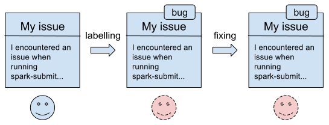
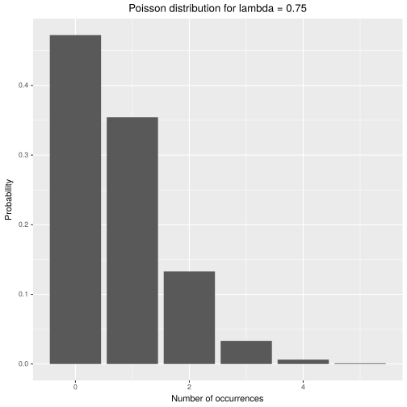

:source-highlighter: coderay
:chapter: 5
:sectnums:
:sectnumoffset: 2
:figure-caption: Figure {chapter}.
:listing-caption: Listing {chapter}.
:table-caption: Table {chapter}.
:leveloffset: 1

= Triaging GitHub issues using a random forest

This chapter covers

- Understanding both the local and the distributed random forest algorithm

This chapter will be a bit out of the ordinary as we won't cover a new real
world example but rather improve on the use case covered in chapter four. As
a result, being familiar with the content of chapter four is required to fully
understand this chapter. Indeed, we will assume understood a few concepts as
well as skim over differents parts that have been fully explained in chapter
four.

As a reminder, in chapter four, we built a machine learning model capable of
identifying the most appropriate label for a GitHub issue. Schematically, the
application could be represented as the two before/after schemas of figures 5.1
and 5.2.

.The current workflow when logging an issue on GitHub.

.The workflow we're aiming for when logging an issue on GitHub.
image::../images/c4_app_after.svg[]

In chapter four, we used a decision tree algorithm to build our classifier. In
this chapter, we will try to improve the performance of our GitHub issue
classifier by using the random forest algorithm which, as we'll see in a
second, relies on decision trees, hence the name forest.

== The random forest algorithm

The random forest algorithm will build a fixed number of decision trees during
the learning phase. During the prediction phase, every decision tree will be
asked for its prediction and a vote will take place. The prediction with the
most votes will be elected and outputted by the random forest algorithm.

This process is shown in figure 5.3 for an example random forest containing
three decision trees.

SCHEMA

If we were to try to predict a label for the following issue

EXAMPLE ISSUE

we would obtain the question label because it received two votes as opposed to
enhancement which received only one vote.

The process of predicting a label for this particular issue is depicted in
figure 5.4.

SCHEMA

Note that, much like decision trees, random forest can be used for regression.
In this case, predictions outputted by the different decision trees are averaged
to produce a final prediction instead of holding a vote.

=== Examples bagging

One interesting aspect of random forests is that every decision tree will be
trained on a different dataset through a process called bagging (for *b*ootstrap
*agg*regat*ing*).

Bagging will create a fixed number of datasets using a fraction of the examples,
chosen randomly, from the original dataset. Typically, we will create as many
datasets as there are trees in our forest. Those examples are sampled with
replacement which means they are randomly chosen and we can have the same
examples multiple times in a resulting dataset.

Let's take a concrete example and let's say we want to bag the dataset made of
the numbers from 1 to 8 in figure 5.4 and we want to create three datasets (our
random forest would be made of three decision trees). Furthermore, we pick 75%
as the fraction of elements in each resulting dataset, this fraction is also
called a sampling rate.

SCHEMA

To build those three datasets we'll pick one piece from the bag in figure 5.4,
look up its value, add the value to a resulting bag and place the piece back in
the original bag. We repeat this process until we've drawn six pieces (75%
of 8) and completed a bag. We do this three times because we want to build three
bagged datasets.

This process could result in figure 5.5. Note that elements are repeated.

SCHEMA

=== Feature selection

Recall that, in chapter four, when building a decision node we had to evaluate
every (feature, split) pair and choose the one that brought the highest
information gain. To add to the random in random forest, we'll only eveluate a
subset of the features when building a node in any decision trees of our random
forest.

The literature on random forests (
https://www.stat.berkeley.edu/~breiman/Using_random_forests_V3.1.pdf and
https://www.stat.berkeley.edu/~breiman/randomforest2001.pdf) suggest to limit
ourselves to the evaluation of the square root of the number of total features
for each node. This means that for each node, a number of features equal to the
square root of the total number of features will be randomly chosen and
evaluated. Another common option is the base two logarithm.

As an example, let's say that I have a dataset which contains four features: A,
B, C and D. We decide to choose to evaluate the square root of the number of
features when building each node. A decision in our random forest could look
like the one in figure 5.6.

SCHEMA

Given that we have four features, we randomly chose two for each node: A and C
for the top node, B and C for the bottom left node and, A and D for the bottom
right node.

Another tree in our random forest could be represented as the one figure 5.7.

SCHEMA

Note that, despite the fact that those two trees were built using the same
features they don't look like each other at all thanks to the feature selection
done for each node.

=== Advantages compared to a single decision tree

You might be wondering why we'd complicate our lives on purpose by having
multiple trees. As a matter of fact, random forests solve a few problems we're
innocuously facing when using single decision trees.

Through example bagging, we aim to get a prediction closer to the reality.
Intuitively this makes sense: collective knowledge is greater than our own. For
example, if we were to ask a contributor of some project to label a GitHub issue
for this same project she might make a mistake. However, if we ask collectively
to all the contributors of this project to label this issue, we might hope that
they arrive to a better conclusion than a single individual and label the issue
correctly.

Thanks to feature selection, we introduce some additional diversity into our
trees. Indeed, no matter how many decision trees we'd build, if there is a
decision rule on a feature that has a far greater information gain than any
others, it is very likely that all of our trees would start the same way even
though bagging took place.

Another advantage of feature selection is that it reduces considerably the
number of decision rules that need to be evaluated. We don't need to go through
all the (feature, split) combinations to choose the best just the splits of the
features that have been selected.

Now that we understand how the random forest algorithm let's see how the
distributed version is implemented in Spark ML.

== The distributed random forest algorithm

Apart from the bagging and the feature selection, the random forest algorithm is
implemented in much the same way as the decision tree algorithm in Spark ML. As
a matter of fact, when using the decision tree algorithm Spark ML treats it as
a random forest of size one for which no bagging is done and no feature
selection occurs.

How does the sampling with replacement work? It occurs in a distributed manner:
for each partition of the dataset, we go through every example in this partition
and choose the number of times an example appears in our sample according to a
Poisson distribution centered at our sampling rate. This process is repeated for
as many times as there are trees in our forest.

.The Poisson distribution.
****
The Poisson distribution is a discrete probability distribution which is usally
used to model the number of times en event occurs, here getting one example out
of the bag. It has one parameter lambda which is its mean and its variance.

To know morem check out: https://en.wikipedia.org/wiki/Poisson_distribution.
****

You can have a look at figure 5.8 which shows the probability density for a
Poisson distribution with λ = 0.75.

.Density for a Poisson distribution with parameter λ = 0.75.

This graph basically says an example has 0.47% chance not to be in our sample (0
occurences), 0.35% chance to be in it a single time, 0.13% to be there twice,
and so on.

As an example, let's say we have at our disposal a partition of some distributed
dataset containing five examples. Moreover, we've chosen 0.75 as a sampling rate
and we want our forest to be made up of three trees. The bagging process would
produce column output in table 5.1 which contains the original example as well
as its number of occurrences in each of the three bags (resulting from the
Poisson distribution).

.Bagging process.
[options="header"]
|===
|input|output
|example 1|(example 1, [1, 1, 0])
|example 2|(example 2, [0, 0, 0])
|example 3|(example 3, [0, 1, 0])
|example 4|(example 4, [1, 2, 0])
|example 5|(example 5, [0, 0, 2])
|===

As a result, the third tree in our random forest would be trained on two
examples which are both example 5, that's the Poisson distribution for you!

The rest of the algorithm happens in the same way as for a single decision tree
so we won't go over the details, refer to chapter four and figure 5.9.

.A cycle in the distributed random forest algorithm in Spark ML.
image::../images/c4_algo.svg[]

The only difference is that we're evaluating decision rules from every tree not
just the one as is the case when dealing with a single decision tree.

== Preparing the data

Because this is the exact same procedure as chapter four, we won't go over it.
Refer to chapter four if need a refresher.

.Where to find the code.
****
You can nonetheless find the code for the data preparation at
https://github.com/BenFradet/spark-ml-in-action/blob/master/chapter5/src/main/scala/io/github/benfradet/spark/ml/in/action/DataPreparation.scala.
****
