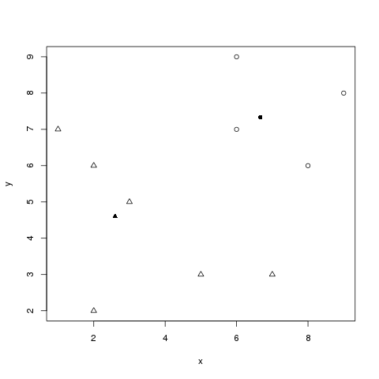
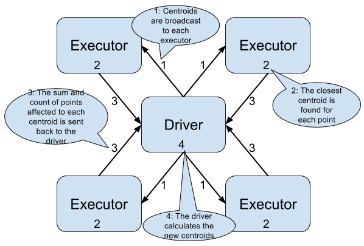

:source-highlighter: coderay
:chapter: 7
:sectnums:
:sectnumoffset: 2
:figure-caption: Figure {chapter}.
:listing-caption: Listing {chapter}.
:table-caption: Table {chapter}.
:leveloffset: 1

= Clustering GitHub users

This chapter covers

- Cluster analysis and how it is used
- Understanding the K-means algorithm and its distributed variant
- Transforming raw data so we can use a clustering algorithm
- Building a machine learning model using the K-means algorithm
- Tuning the pipeline to get the best results possible

Imagine you're working for GitHub and you are put in charge of finding the users
who might be most tempted by a new offering: 50% discount on the fee for private
repositories for new paying users. Take a second to think about how to find
those users.

Should we target power users? How do we define a power user? By setting a lower
bound on an arbitrary metric such as the number of commits per month? If the
bound is too low we'll bother people who were never interested by the offer, if
too high we'll limit the impact of our campaign.

What if I'm the CEO of a small company developing open source products? As the
main contact with our customers, I report their problems to the dev team by
logging issues into GitHub: am I not someone who might be interested by the
offer?

A lot of questions, a lot less answers.

Thankfully cluster analysis will solve our issues.

== Cluster analysis

In contrast to the chapters on classification and regression, where we tried to
predict values for new data based on a lot of previously seen examples, we don't
know beforehand exactly what we're looking for with clustering algoritms. What
we want, however, is to gain insight into the structure of the data.

The goal of cluster analysis is to gather elements that share some similarities
in a cluster or grouping. The elements inside a cluster are supposed
to be more similar to each other than to elements coming from other clusters.
To solve our problem, we would ideally have two clusters: the users who might be
interested in our offer on one side and the others on another side. In practice,
this won't be that easy unfortunately because we don't know in advance which
insight the cluster algorithm is going to reveal as well as the most appropriate
number of groupings.

To become familiar with cluster analysis and understand what it does we'll study
an artificially small and simple dataset. Suppose we have access to a random
sample of 50 people from the 2015 National Health Interview Survey (NHIS)
designed by the United States' Centers for Disease Control and Prevention (CDC).
The whole dataset can be obtained on the CDC's website
(http://www.cdc.gov/nchs/nhis/index.htm). We then plot their height and weight
in figure 7.1.

.Weight in pounds as a function of height in inches fof 50 randomly sampled people from the 2015 NHIS.
image::../images/before.png[]

Using those heights and weights, we split our data into two clusters using a
clustering algorithm we'll detail in the next section (figure 7.2).

.Weight as a function of height for 50 randomly sampled people from the 2015 NHIS separated into 2 clusters. The elements belonging to the first cluster are denoted by crosses, those belonging to the second are represented as circles.
image::../images/kmeans.png[]

Thanks to the clustering algorithm, we have effectively discovered new
information: we've separated the sample into two categories. However, we don't
know what those categories correspond to. This will always be the case when
performing cluster analysis. We'll find clusters of data points in a first step
and then we will have to investigate to find out what those clusters mean.

In our case, it turns out they fit rather well the gender of the person which
was initially in the dataset: that's the insight we gained from applying a
clustering algorithm with 2 groupings to our data.

The effective gender associated with each data point is shown in figure 7.3.
Males are represented as circles and females as crosses.

.Weight as a function of height for 50 randomly sampled people from the 2015 NHIS. Females are represented as crosses and males as circles.
image::../images/real.png[]

If you compare the two plots (figure 7.2 and 7.3) you will notice that they are
very similar. By clustering only the initial data (heights and weights of
people) we managed to uncover the gender of most of the data points.

However, one question remains: how did we build the clusters? That's what we'll
find out in the next section.

== The K-means algorithm

K-means is one of the most widely known and used clustering algorithms because
it is fairly easy to understand and it has good performance given a bit of
domain-specific knowledge. As a result, K-means is supported by Spark ML, as are
other clustering algorithms.

At a high level, K-means tries to build _K_ clusters. It starts with _K_ (a
number chosen by the user of the algorithm) random clusters and iteratively
refines those clusters until some pre-defined stopping criteria are reached.

Groupings, or clusters, are formed based on a notion of distance between data
points: the closest data points according to the chosen distance are grouped
together. In Spark ML, only the Euclidean distance is supported.

.Euclidean distance
****
The Euclidean distance between two points in two dimensions `(x1, y1)` et
`(x2, y2)` is defined as: `sqrt((x1 - x2)^2 + (y1 - y2)^2)`.
****

The fact that we will have to compute distances between data points is a
limitation to keep in mind. As a result, the K-Means algorithm can handle only
numeric features.

=== Flow of the algorithm

Next, we are going to describe a typical starting cycle for the K-means
algorithm. We start with a dataset about which we know nothing and _K_, the
number of clusters we want to obtain. (As we'll see later in the chapter,
choosing an appropriate value for _K_ is a problem in itself.)

The following is a synthetic dataset containing 10 data points we are going to
work with throughout the explanation (table 7.1 and figure 7.4).

.10 synthetic data points used to illustrate our point.
[options="header"]
|===
|x|y
|1|7
|2|6
|5|3
|3|5
|9|8
|2|2
|8|6
|7|3
|6|9
|6|7
|===

.Scatter plot of the 10 synthetic data points used to illustrate our point.
image::../images/kmeans_before.png[]

We then randomly choose _K_ (in our case 2) data points from the dataset and
pick them as our initial centroids (the term used to refer to the center of our
clusters) as shown in table 7.2 and figure 7.5.

.K=2 randomly chosen data points which will serve as initial centroids.
[options="header"]
|===
|x|y
|7|3
|9|8
|===

.10 synthetic data points from which we randomly selected two to serve as our initial centroids (a circle for the first cluster center, a triangle for the second).
image::../images/kmeans_init.png[]

When this is done, we repeat the following process:

- We compute, for every point, the distance from this point to each centroid. We
affect a cluster depending on the closest centroid, as shown in figure 7.6:

.Then synthetic data points for which we assigned a cluster based on the closest centroid. The centroids are filled and the "normal" points are not. The points belonging to the first cluster are represented as circles and those belonging to the second cluster as triangles.
image::../images/kmeans_first.png[]

- We compute new centers (which are not part of the original dataset) for
each cluster by averaging the positions (hence the name K-means) of all the
points belonging to a cluster (the new centers can be seen in table 7.3 and
figure 7.7).

.The computed centers for the first iteration.
[options="header"]
|===
|x|y
|7.25|7.5
|3.34|4.33
|===

.10 synthetic data points for which we computed new centroids by averaging the position of each data point belonging to the cluster. The new centers are filled.

The last two steps describe a typical iteration: affecting clusters to data
points and updating our centroids. This process is repeated until some stopping
conditions are met, which will be detailed in the next section.

Note that small variations exist for the K-means algorithms especially for
finding initial centroids such as the following:

- Randomly assigning clusters to every point and computing the initial clusters'
centers in an ad hoc manner
- Choosing data points as centers where the probability of choosing the data
point _d_ is high if _d_ is far from any previously chosen centers (this is
called K-means||, pronounced K-means parallel)

=== Stopping conditions

We still have one important aspect to cover: when is the algorithm supposed to
report its results back to us? To answer this question, we need to define a
state where we can stop the algorithm: this is also known as the convergence of
an iterative algorithm. For K-means, we usually define convergence as one of the
following:

- The iteration where the affected cluster for each point hasn't changed
- The iteration where the centroids have not moved or moved very slightly
compared to the previous one (by a distance smaller that a tolerance specified
by the user).

However, a shortcoming of defining convergence as such is that it might take a
very large number of iterations to be reached. That is why, we will cap the
number of iterations the algorithm can perform. Attaining this limit will result
in the termination of the algorithm.

== The distributed K-means algorithm

So far, we've only studied the algorithm as it would work on a single machine.
We still have no clue about how it works inside Spark ML in a distributed
fashion. This is what this section will help uncover.

Let's see how to interact with the K-means algorithm in Spark ML in listing 7.1.

.The entry point to the K-means algorithm in Spark ML.
[source,scala]
----
import org.apache.spark.ml.clustering.KMeans
val kmeans = new KMeans().setK(2)
----

The entry point to the K-Means API in Spark ML is the `KMeans` class in the
`org.apache.spark.ml.clustering.KMeans` package which you can instantiate with
`val kmeans = new KMeans()`. We pick a value for _K_ with the `setK` method
which defaults to two.

Just as before, we need a way to designate initial centers, this is shown in
listing 7.2.

.Setting an initialization mode for the K-means algorithm.
[source,scala]
----
import org.apache.spark.ml.clustering.KMeans
val kmeans = new KMeans()
  .setK(2)
  .setInitMode("random")
----

Spark ML comes with two methods for choosing our initial centroids thanks to the
`setInitMode` method.

- _random_: _K_ data points are randomly sampled across our distributed data set
and elected as our initial centroids.
- _k-means||_: A first center is randomly picked among our distributed data
points. For a predefined number of steps (usually two) an average of _2 x K_
data points are picked from our distributed dataset on average as new centers
with probability proportional to their squared distances to the previously
selected centers. Finally, because there might be more than _K_ centers
(_2 x 2 x K_ on average) a variant of K-means is locally run by Spark ML on our
candidate centers to get the final _K_ centers. This initialization mode is the
default in Spark ML.

Now that the initial centers have been chosen, let's find out how the algorithm
is actually run.

Just as we did for the non-distributed version of the algorithm, we will perform
a new iteration until:

- The centroids we computed for this iteration are close enough from the
centroids we got from the previous iteration. They effectively have to be less
than a tolerance distance away, which is specified by the `setTol` method. The
default tolerance is 1e-4.
- We reach the maximum number of iterations. This is also specified by the
user through the `setMaxIter` method. The default maximum number of iterations
is 20.

Those stopping criteria are shown in listing 7.3.

.Setting the tolerance and maximum number of iterations for the K-means algorithm.
[source,scala]
----
import org.apache.spark.ml.clustering.KMeans
val kmeans = new KMeans()
  .setK(2)
  .setInitMode("random")
  .setTol(1e-4)
  .setMaxIter(20)
----

Following is a schema of an iteration of the K-means algorithm (figure 7.8).

.Schema of an iteration of the K-Means algorithm in Spark ML with 4 executors

As far as Spark ML is concerned, an iteration will consist of sending the
centroids computed by the previous iteration (or the initial ones if it's the
first) to every executor in our Spark cluster (step 1 in figure 7.8).

When this is done, the distance between each data point present on this executor
and the centroids will be computed. The closest centroid will be kept as
affected cluster for this data point. While finding the closest centroid, the
sum of the data points affected will be maintained (because they are
vectors) as will their number for each cluster (step 2 in figure 7.8).

This data is then retrieved on the driver (step 3 in figure 7.8). It lets us
compute the new centroids by dividing the sum of data points by their number for
each cluster (step 4 in figure 7.8).

Now that we understand how K-Means works inside of Spark ML, we're ready to
use it to solve our use case. The first step will be to format our data as
demonstrated in the next section.

== Preparing the data

As we return to the GitHub archive, remember that our raw data is just events
that happened on GitHub over a certain period of time. We need data that
represents the behavior of each user on GitHub to regroup them into clusters.
Plus, this data must be made of numeric features because the algorithm will be
computing didstances between data points. That's what we're going to do in this
section: go from the raw events to a dataset containing the activity of every
user.

To do so, we will count the occurrences of the different types of action one
can perform on GitHub for each user.

As a result, we're looking to go from our raw JSON event data listed in table
7.4 to what is shown in table 7.5.

.Our raw dataset.
[options="header"]
|===
|actor|type|payload|etc
|{user data}|ClosedIssuesEvent|{ content }|...
|{...}|PushEvent|{...}|...
|{...}|RepositoryCreateEvent|{...}|...
|{...}|PushEvent|{...}|...
|{...}|BranchCreateEvent|{...}|...
|===

.The dataset we're aiming to get at the end of our data preparation.
[options="header"]
|===
|user|Number of pull requests opened|Number of issues logged|etc
|user1|3|1|...
|user2|0|2|...
|user3|0|0|...
|user4|4|7|...
|user5|1|0|...
|===

We purposefully omitted a number of columns in both tables not to clutter them,
the goal is just to give you a broad idea of what each dataset should look like.

If you want to follow along, fire up your REPL, through the spark-shell command.
You can alternatively have a look at the source code in the repository under the
_chapter7_ folder in the _DataPreparation.scala_ file
https://github.com/BenFradet/spark-ml-in-action/blob/master/chapter7/src/main/scala/DataPreparation.scala.

=== Loading the data

First up, let's load some sample data. We have all the events that occurred on
GitHub during January first in the _2016-01-01.json.gz_ file at
https://github.com/BenFradet/spark-ml-in-action/blob/master/chapter7/src/main/resources/2016-01-01.json.gz.

In listing 7.2, we'll be loading this data into a DataFrame, we'll be assuming
the file is available from the _/data/2016-01-01.json.gz_ path.

.Loading our dataset using the _SparkSession_ available in the REPL.
[source,scala]
----
val inputPath = "/data/2016-01-01.json.gz" // <1>
val events = spark.read.json(inputPath)    // <2>
----
<1> The path where our data is located.
<2> We specify the file is to be read as JSON.

You might be wondering why we're telling Spark to read data in JSON and we give
it a gzipped file. Spark will take care of uncompressing our file before reading
it.

Another nice things when reading JSON data with Spark SQL is that the schema
of the data will be inferred; you can verify that yourself by printing the
schema of the loaded DataFrame as shown in listing 7.2.

.Printing the schema of our data.
[source,scala]
----
events.printSchema()

// root
//  |-- actor: struct (nullable = true)
//  |    |-- avatar_url: string (nullable = true)
//  |    |-- gravatar_id: string (nullable = true)
//  |    |-- id: long (nullable = true)
//  |    |-- login: string (nullable = true)       // <1>
// ...
//  |-- payload: struct (nullable = true)          // <2>
// ...
//  |-- type: string (nullable = true)             // <3>
// ...
----
<1> The _login_ will let us identify each user.
<2> The _payload_ is a complex JSON represented as a _struct_ by Spark and will
effectively contain what happened for this specific event.
<3> The _type_ will reflect what action happened such as the opening of a pull
request or the writing of a comment on an issue.

The schema is huge because it is the result of the union of each different
schema and because there is a different schema for each event type, it adds up.
As a result, a lot has been omitted and only what is of interest to us has been
kept.

As you can see, the fields' types seem to have been appropriately inferred.

The fields that interest us in this chapter are the _actor_, the _type_ of
event as well as a few fields in the _payload_ which are in bold in listing 7.2.

You can have a look at the first 5 records we loaded by running the following
command: `events.show(5, truncate = false)`.

As you can see, there is a lot of information we don't need such as the id of
the event, metadata about the user (such as her/his avatar's URL), or the event
itself (the concerned repositories for instance).

What's more, even if we consider only the information we need, it's not ready to
be fed into the K-Means algorithm just yet because we only need numeric
features.

As a result, we'll have to transform those raw events to fit our needs.

=== Transforming our events

Keep in mind that we want the number of every type of GitHub actions done to
serve as an indicator of each user's behavior.

.The actions GitHub keeps track of
****
There are quite a few actions that GitHub makes available in the GitHub archive,
you can find a list of all the possible events at
https://developer.github.com/v3/activity/events/types/.

A thorough description of each event is also given in chapter 3.
****

We can look at the different type of events in our dataset with the code
in listing 7.3.

.Displaying the different event types.
[source,scala]
----
events
  .select("type")         // <1>
  .distinct()             // <2>
  .show(truncate = false) // <3>
----
<1> We project on the _type_ field because it's the only one we're interested
in.
<2> We want to know the distinct event types.
<3> We want to show those distinct event types without Spark truncating them.

If you look carefully at the descriptions given by GitHub for each event, you
will find out that, unfortunately, some event types have been grouped under the
same umbrella even though they represent different actions. This is the case for
the following:

- https://developer.github.com/v3/activity/events/types/#createevent[CreateEvent],
which can represent the creation of a repository, a branch, or a tag.
- https://developer.github.com/v3/activity/events/types/#deleteevent[DeleteEvent],
which can represent the deletion of a branch or a tag.
- https://developer.github.com/v3/activity/events/types/#issuesevent[IssuesEvent],
which can represent the assignment, the labeling, the opening of an issue, and
so on.
- https://developer.github.com/v3/activity/events/types/#issuecommentevent[IssueCommentEvent],
which can represent the creation, edition, or deletion of an issue comment.
- https://developer.github.com/v3/activity/events/types/#pullrequestevent[PullRequestEvent],
which can represent the assignment, the labeling, the opening of a pull request,
and so on.
- https://developer.github.com/v3/activity/events/types/#pullrequestreviewcommentevent[PullRequestReviewCommentEvent],
which can represent the creation, edition, or deletion of a pull request
comment.
- https://developer.github.com/v3/activity/events/types/#repositoryevent[RepositoryEvent],
which can represent the creation, deletion, publicization (going from closed to
open source), privatization (going from open to closed source).

As a result, we have to split up those events to treat the creation of a
repository differently from the creation of a tag, for example.

Fortunately, the event subtype is always specified in either the action or
ref_type JSON field in the payload of our JSONs. For example, for the
CreateEvent, the ref_type can be repository, branch, or tag (listing 7.4).

.Example payload field for a CreateEvent.
[source,json]
----
"payload": {
  "ref": "0.0.1",
  "ref_type": "tag",         // <1>
  "master_branch": "master",
  // ...
}
----
<1> Thanks to ref_type we know that this CreateEvent refers to the creation of
a tag.

Another example, for the IssueCommentEvent, the action can be created, edited
or deleted (listing 7.5).

.Example payload field for a IssueCommentEvent.
[source,json]
----
"payload": {
  "action": "created", // <1>
  "issue": {
    "url": // ...
  }
}
----
<1> Thanks to the action we know that this IssueCommentEvent refers to the
creation of a comment on a issue.

We need to create a function that looks at the type field. If it's a type of
event representing different things such as CreateEvent, we'll have a look at
either the ref_type or the action fields inside the payload (the ref_type in
case of CreateEvent). Thanks to this information, we'll be able to specify the
type of event as TagCreateEvent instead of just CreateEvent, if we continue
witht the example described in listing 7.4, for example.

Spark SQL uses the concept of user-defined function (UDF) to do this type
of processing. This means that we'll have to write a Scala function that will be
applied to every record in our dataset.

.UDF
****
Spark SQL builds on the concept of user-defined function which you might be
familiar with if you've interacted with databases before.

It's a way of creating an operation that couldn't be created directly (or too
complicated to write) with the API itself, namely the DataFrame API here.

If you want to know more about the concept, I invite you to checkout:
https://en.wikipedia.org/wiki/User-defined_function.
****

We start with the function in listing 7.6 that looks for the appropriate event
type for each event. In case of umbrella event types, it will look for a way
to specify it either through the action of ref_type fields in the payload.

.Function "subtyping our events".
[source,scala]
----
import org.apache.spark.sql.Row
val splitEvent = (evtType: String, payload: Row) => {
  val getEvent = (evt: String, subEvt: String) => subEvt.capitalize + evt // <1>

  val refTypeEvents = Set("CreateEvent", "DeleteEvent")                   // <2>
  val actionEvents = Set("IssuesEvent", "PullRequestEvent", "IssueCommentEvent",
    "PullRequestReviewCommentEvent", "RepositoryEvent")                   // <3>

  evtType match {
    case s if refTypeEvents.contains(s) =>
      getEvent(s, payload.getAs[String]("ref_type"))
    case s if actionEvents.contains(s) =>
      getEvent(s, payload.getAs[String]("action"))
    case "WatchEvent" => "StarEvent"
    case other => other
  }
}
----
<1> A one-liner which turns a type and subtype of event into a new event
type. For example, if we have CreateEvent as `evt` and repository as `subEvt`,
it will return RepositoryCreateEvent.
<2> The set of events for which the subtype is contained in the ref_type field
of the payload.
<3> The set of events for which the subtype is contained in the action field of
the payload.

Our function takes the event type contained in the type column which is a
String and the payload column which is a complex JSON type with many nested
fields this why it is typed as _Row_.

It checks the value of `evtType` and

- If it is one of the `refTypeEvents`, we get its subtype from the ref_type
field in the payload and we call our `getEvent` function.
- If it is one of the `actionEvents`, we get its subtype from the action field
in the payload and we call our `getEvent` function.
- If it is WatchEvent, we transform it into StarEvent because it is actually
referring to someone starring a repository and not watching it. Refer to
the documentation for this type
https://developer.github.com/v3/activity/events/types/#watchevent to know more.
- If it is not an umbrella event type, we leave it alone.

In summary, our function takes an event type and a payload in JSON and sends
back the most precise type of event.

When we have defined our function, we can turn it into a UDF, as shown in
listing 7.7.

.Turning our function into a UDF.
[source,scala]
----
import org.apache.spark.sql.functions.udf
val splitEventUDF = udf(splitEvent)
----

Note that a UDF is a black box as far as Spark SQL is concerned and it won't try
to optimize what's being done. Consequently, UDFs should be used sparingly for
things that are not possible through the multitude of operators offered by
Spark SQL. You can find a list of the operators supported by Spark SQL at
http://spark.apache.org/docs/latest/api/scala/index.html#org.apache.spark.sql.functions$.

Now that our UDF is defined, we can use it to project our raw events and keep
only the columns we need, which are the username of the user who performed the
event and the type of event that was performed (listing 7.8).

.Projecting our events, keeping the columns we need: _username_ and _type_.
[source,scala]
----
import org.apache.spark.sql.functions.lit
val projectedEvents = events.select(
  $"actor.login".alias("username"),                 // <1>
  splitEventUDF($"type", $"payload").alias("type"), // <2>
  lit(1L).alias("count")                            // <3>
)
----
<1> We go look for the login field inside the actor JSON field and we alias it
(change its name) to username.
<2> We use our UDF using the type and payload columns, we alias the result as
type.
<3> We count the events and because one line corresponds to one occurrence, we
affect it the literal 1 for every line. We'll be summing over this column in
the next subsection.

You might be wondering what the $ sign stands for. It is a shorthand notation
to access the column with the specified name. So, when we say `$"actor.login"`,
we're actually referring to the column named actor.login in our dataset and
not just the string actor.login.

Now our dataset comprises records containing a username as well as the
action performed. Don't take my word for it, check the schema and the first
few records as shown in listing 7.9.

.Checking the schema and the first few records of our transformed dataset.
[source,scala]
----
projectedEvents.printSchema()
projectedEvents.show(5, truncate = false)
----

We now have a dataset that looks similar to that in table 7.6.

.Dataset after projection and application of our UDF.
[options="header"]
|===
|username|type|count
|user1|ClosedIssuesEvent|1
|user1|PushEvent|1
|user2|RepositoryCreateEvent|1
|user3|PushEvent|1
|user4|BranchCreateEvent|1
|===

=== Pivoting our data

Remember what we wanted the dataset to look like at the start of the section: it
had one column for every type of event and the number of times this event
occurred in the corresponding cell. As is, we have all the data we need but not
the right columns. Note, however, that the names of the columns we want are in
the type column.

We effectively need to reshape our data to create one column per distinct event
type that is present in the type column and fill them with the corresponding
data in the count column. Spark SQL comes with a feature called _pivot_ that
provides this functionality - a common operation in data analysis.

We now pivot our table, as shown in listing 7.10.

.Pivoting our table by the _type_ column.
[source,scala]
----
val pivotedEvents = groupedEvents
  .groupBy("username")            // <1>
  .pivot("type")                  // <2>
  .sum("count")                   // <3>
  .na.fill(0L)                    // <4>
----
<1> We group our data by the username column to have one row per user.
<2> We pivot our table by the type column.
<3> We aggregate our results by summing the values in the count column so they
are added up and we obtain the right number of occurrences for each user / event
combinations.
<4> Because our data is sparse: a lot of users perform only a small set of
tasks, we'll get a lot of null or not available (na for short) in our dataset,
which we replace or fill by 0 because this type of event didn't occur for this
user.

We now have a dataset in the following form (table 7.7).

.Our dataset with one column per event type and its occurence in the corresponding cell.
[options="header"]
|===
|username|OpenedPullRequestEvent|ReopenedPullRequestEvent|etc
|user1|0|0|...
|user2|4|0|...
|user3|3|1|...
|===

We can now safely remove the username column because we used it to group the
events in `pivotedEvents`, we don't have a use for it anymore in listing 7.11.

.Dropping the username column.
[source,scala]
----
val userActions = pivotedEvents.drop("username")
----

We get rid of the username column because it doesn't bring any value for cluster
analysis. The use case where it might be useful would be to determine, in an ad
hoc manner, which users belong to which clusters. However, this won't be
covered in this book.

The dataset is now its in final form (table 7.8).

.Our dataset in its final form.
[option="header"]
|===
|OpenedPullRequestEvent|ReopenedPullRequestEvent|etc
|0|0|...
|4|0|...
|3|1|...
|===

=== Saving the data

We just have one more item on the list of things left to do, which is saving
our data so we can use it and reuse it when we'll try out the K-Means algorithm
(listing 7.12).

.Saving our data in CSV format.
[source,scala]
----
val outputPath = "/data/2016-01-01.csv"
userActions
  .write                    // <1>
  .format("csv")            // <2>
  .option("header", "true") // <3>
  .save(ouputPath)          // <4>
----
<1> We want to write (as opposed to read) our dataset to disk.
<2> We use the CSV format.
<3> We specify that we want to write the headers as well.
<4> `save` will actually trigger the writing.

== Building the K-Means model naively

Now that our data is ready to be fed into the K-Means algorithm we can dive in!

.Where to find the code.
****
The code for this section can be found in the repository under the `chapter7`
folder in the _KMeans.scala_ file
https://github.com/BenFradet/spark-ml-in-action/blob/master/chapter7/src/main/scala/KMeans.scala.
****

=== Reading the dataset built during the previous section

If you're following directly from the previous section, you don't have to read
back the data and you can safely skip this subsection. However, if you don't
have the data loaded and available as a DataFrame, you will need to read it
back, as shown in listing 7.13.

.Reading back our user behavior data.
[source,scala]
----
val outputPath = "/data/2016-01-01.csv"
val userActions = spark
  .read                          // <1>
  .format("csv")                 // <2>
  .option("header", "true")      // <3>
  .option("inferSchema", "true") // <4>
  .load(inputPath)               // <5>
----
<1> Read our dataset from disk.
<2> Our dataset is in the CSV format.
<3> Read headers.
<4> Infer the schema of our data.
<5> _load_ will actually trigger the reading.

We ask Spark to infer the schema of our data, that way, numbers will be
correctly typed as opposed to every field falling back to string.

=== Assembling our columns

One of the  slight quirks of the algorithms in Spark ML is that they expect all
the features of your dataset to be smooshed together into a single vector
column before applying the algorithm, it won't do it for us. Fortunately for us,
there is a Transformer dedicated to this task, VectorAssembler, which we're
going to create in listing 7.14.

.Creating our VectorAssembler.
[source,scala]
----
val assembler = new VectorAssembler()
  .setInputCols(userActions.columns)  // <1>
  .setOutputCol("features")           // <2>
----
<1> Our input columns which are, in our case, every single one.
<2> features will be the name of our output column containing a vector with the
values from every column.

If you recall from the previous chapters, a Transformer takes a DataFrame and
turns it into another one when calling its `transform` method (listing 7.15).

.Applying our VectorAssembler.
[source,scala]
----
val formattedUserActions = assembler.transform(userActions)
----

As a result, we're going to be able to go from our original dataset (table 7.9)
to the one described in table 7.10 where a features column has been added
containing our vector representing the other columns.

.The dataset before assembling.
[options="header"]
|===
|OpenedPullRequestEvent|ReopenedPullRequestEvent|etc
|0|0|...
|4|0|...
|3|1|...
|===

.The dataset after assembling.
[options="header"]
|===
|OpenedPullRequestEvent|ReopenedPullRequestEvent|etc|features
|0|0|...|(21, [5, ...], [1.0, ...])
|4|0|...|(21, [0, ...], [4.0, ...])
|3|1|...|(21, [0, 1, ...], [3.0, 1.0, ...])
|===

You'll notice that the vectors in the features column are not represented in
a usual way. This is because they are _sparse_ (contain a lot of 0s).

.Representation of sparse vectors in Spark SQL
****
Spark SQL optimizes the amount of space sparse vectors take by representing them
a bit differently from what you would normally expect.

For example, if you see a vector represented as (8, [5], [1.0]), it means the
vector contains 8 elements, all of them zeros, except the 6th
element, because the indexing is zero-based, which contains 1.0. It's equivalent
to (0.0, 0.0, 0.0, 0.0, 0.0, 1.0, 0.0, 0.0).
****

=== Using K-Means

Now that we have a column containing all our features, we're ready to apply the
algorithm.

Because the algorithm will make multiple passes over the data we first need to
cache it, this will tell Spark to store the DataFrame as deserialized objects
in the JVM (if it's not possible because the data is too big, it will splill to
disk).

.Caching our data
[source,scala]
----
val cachedUserActions = formattedUserActions.cache()
----

However, we need to choose at least a value for K. Choosing an appropriate value
for _K_ is a problem. Indeed, without a lot of domain-specific knowledge, we can
only make an educated guess as to the number of groupings we might find in a
dataset. Coming back to our example, do you know into how many clusters we could
divide our GitHub users? Take a second to think of the possible groups of user
based on their behavior.

A few ideas come to mind such as the following:

- Lurker: someone using GitHub as a bookmark manager for software projects,
starring repositories that might be of interest
- Reporter: someone who logs issues only when they encounter a problem using a
specific project
- Occasional / new contributor: a user who solves easy-to-fix issues a couple of
times a month
- Hobbyist: a developer spending his free time contributing to existing projects
or developing his own projects
- Professional: she / he is coding on GitHub as part of her / his daily job
working for a company that develops everything in the open

We end up with _K_ = 5, which is as a good value to start with as any. However,
this value will need tuning because, after all, it's just a guess and it doesn't
mean the data is best split using five clusters.

Let's try this using the code in listing 7.16.

.Applying the K-Means algorithm.
[source,scala]
----
val kmeans = new KMeans()
  .setK(5)                                      // <1>
  .setMaxIter(20)                               // <2>
  .setTol(1e-4)                                 // <3>

val kmeansModel = kmeans.fit(cachedUserActions) // <4>
----
<1> Creating a _KMeans_ object with K = 5.
<2> We define a maximum number of iterations in case the algorithm takes too
many iterations to converge on its own. 20 iterations is the default value.
<3> If all centers move less than 1e-4 distance we'll deem the algorithm as
having converged.
<4> Computing a _KMeansModel_ on our dataset. This will effectively run the
algorithm and find out our 5 centers.

Note that 1e-4 is an absolute distance.

That's it. We now have our K-Means model ready to be investigated.

=== Metrics and centers

From the model, we can find the cluster centers through the `clusterCenters`
member of `kmeansModel`, as shown in listing 7.17.

.Printing out where our cluster centers are located.
[source,scala]
----
println("Cluster centers:")
kmeansModel.clusterCenters.foreach(println)
----

We can also obtain a metric on our clustering by computing its "cost," which is
actually the sum of squared distances affected to a cluster to the closest
cluster center for each cluster. It is also called _the within-cluster sum of
squares_ (WCSS). WCSS is accessible through the `computeCost` method on
`kmeansModel` (listing 7.18).

.Computing the WCSS.
----
val wcss = kmeansModel.computeCost(formattedUserActions)
println(s"Within-cluster sum of squares for 5 clusters = $wcss")
----

=== Affecting clusters to our data points

If you remember from chapter 1, a machine learning algorithm is represented
as an Estimator (the `kmeans` variable in our case), which has a `fit` method
that produces a machine learning model that is a Transformer (the `kmeansModel`
variable here). As such, we can call the `transform` method on `kmeansModel` to
obtain the clusters (listing 7.19).

.Affecting cluster to our data points.
[source,scala]
----
val userActionsWithCenters = kmeansModel
  .transform(formattedUserActions)       // <1>
  .select("features", "prediction")      // <2>
----
<1> We call `transform` which will add a prediction column to our dataset
containing the affected cluster.
<2> We keep only the `features` and `prediction` column to unclutter the
dataset.

You should obtain something that looks like the content of table 7.10.

.Resulting clusters.
|===
|features|prediction
|(21,[5],[1.0])|0
|(21,[3,5,16,17],[1.0,2.0,1.0,3.0])|1
|(21,[5,7,18],[3.0,2.0,1.0])|2
|===

== Tuning

This is not filled because I need to run the algorithm on a lot more data which
I can't do on my own machine.

=== Evaluation

same

=== Running multiple times

same
=> results may depend on the initial centroids

=== Choosing K

same

== Summary

same

Fiddle with tol + max iter to see if you can get better results
Also try out other algos such as LDA or...
