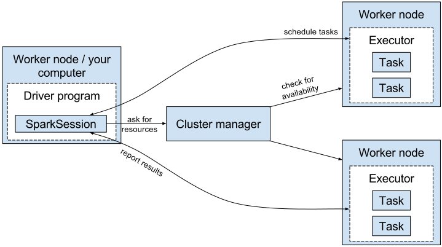
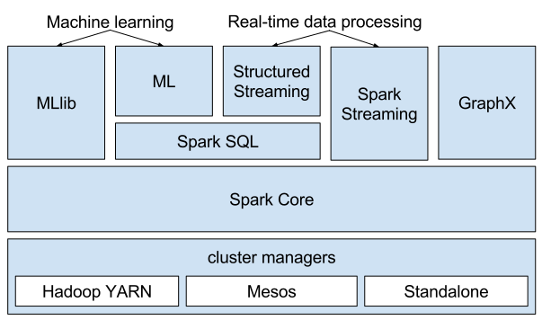
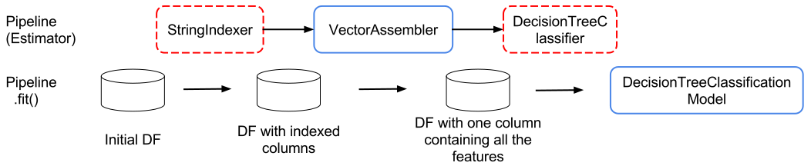
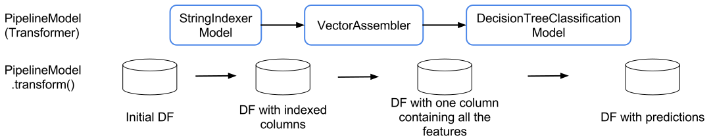

:source-highlighter: coderay

= Introduction
:chapter 1:

This chapter covers:

- What is Apache Spark?
- The core Spark concepts
- What is Spark ML?
- The benefits of Spark ML over MLlib
- The core Spark ML concepts

We are all confronted to large scale machine learning in our daily lives:

- buying something on Amazon
- watching a tv show or a movie on Netflix
- searching for an image on Google
- finding people to follow on Twitter
- scrolling through a Facebook news feed
- finding a place to stay on vacation on AirBnB
- hailing an Uber

Behind those features lies different machine learning domains like:

- recommender systems (previewing the next movie you might want to watch)
- classification (displaying all the images where a cow appears)
- regression (estimating the fare for your next ride or the daily rate for the
place you're renting for your next holidays)
- etc

Enters Apache Spark and its machine learning library Spark ML, used by some of
the companies discussed above to implement those features. For those companies,
as we'll see later in this chapter and in the book, Spark ML fits the bill
perfectly because:

- it's distributed: you have to be able to deal with a huge quantity of data
- it comes with a flurry of machine learning algorithms: all of the use cases
above can be addressed with Spark ML
- it's easy to use: spend a lot less time onboarding new people
- it's extendable: you have a great idea for a brand new machine learning
algorithm and you want to try it out
- it's open source: your new algorithm is revolutionary and you want everyone to
benefit from it

Fortunately, there are still a lot of large scale machine learning use cases to
be uncovered, as we'll find out throughout the book, some of them probably at
your own company.

This chapter gives an introduction to Apache Spark, Spark ML and the core
concepts which will be used throughout the book. If you're already familiar with
those concepts, you can go straight to chapter 2.

== What is Apache Spark?

Apache Spark is an open source clustering framework. As a distributed data
processing framework, it encompasses a few common features such as
fault-tolerance and linear scalability.

However, what sets it apart from its predecessor Hadoop is threefold:

- speed
- accessibility
- great out-of-the-box integration

First and foremost, speed. Spark relies on memory to store its intermediate
results and not disk which considerably decreases processing time so you can
have more time doing your job: make your machine learning application better.

Next, which, I think, is as important as Spark's speed is its accessibility.
A lot of effort has been put into reducing the barrier of entry in order to be
productive with a big data framework. This translates into a REPL
(read-eval-print loop) which lets you quickly experiment and make quick and
dirty prototypes. This is particularly important if you're in a "fail fast fail
often" mindset.
Anoter aspect, which goes hand in hand with the REPL is a simple and functional
API which lets you express distributed data processing operations as you
would write local collection transformations using the Scala API.
Finally, a lot of other components are made available directly through Spark
like graph or stream processing which saves you a lot of headaches when trying
to use together two existing but distinct frameworks.

Last but not least, Spark benefits from great integration with external data
sources like Hive or Kafka which makes integrating Spark with your existing
data infrastructure seamless.

To give you an overview of what a Spark cluster looks like:

.Overview of a Spark cluster with two nodes

On the architecture side, each worker node will run its own JVM process called
an _Executor_ in Spark parlance. Each _Executor_ will run its own set of tasks,
in a multithreaded manner, which have been scheduled by the _SparkSession_. The
_SparkSession_ is part of a driver program, another JVM, which can be
run on a worker node or on your own computer. The _SparkSession_ is also
responsible for interacting with the cluster manager which is responsible for
allocating resources to your Spark application, more on that later.

As opposed to other frameworks, when using Spark you can benefit from different
subprojects which are integral components of Spark.

.The different Spark subprojects: graph processing, stream processing, machine learning

=== Spark Core

As its name implies, Spark Core contains the base set of functionalities you can
expect from a distributed data processing framework: fault tolerance mechanisms,
networking, serialization, interactions with distributed storage, executors,
etc.

Resilient distributed datasets (_RDDs_), which is the low-level programming
abstraction in Apache Spark, are also defined in the core. _RDDs_ can be viewed
as a strongly-typed distributed collection of items. One of the nice things
when dealing with _RDDs_, which reduce considerably the barrier of entry when
using Spark, is that they define the same API you use when dealing with Scala
collections.

=== Spark SQL

Spark SQL is the module dedicated to structured data processing. As you might
have guessed, it lets you interact with data using SQL, however, that's not all.
Spark SQL also defines two concepts: _DataFrames_ and _Datasets_ (which we'll
expand on later in this chapter) which can be thought of as distributed
collections of data.

The main benefit when using Spark SQL compared to the traditional _RDD_ API is
that all the operations done with Spark SQL will go through an optimizer, called
Catalyst. For example, with smart data sources, when using a filter, data will
be filtered directly in the source and won't be retrieved into Spark, this is
called a filter pushdown.

As a result, no matter which language (Scala, Java, Python, R) or API
(_Dataset_, _DataFrame_, SQL) you use,
everything will go through the same optimizer and result in the same
performance. This is different from the _RDD_ API where you had the best
performance using Scala.

You can find the paper presenting Catalyst at:
http://people.csail.mit.edu/matei/papers/2015/sigmod_spark_sql.pdf

=== Spark Streaming

Spark Streaming handles the processing of data streams which can come from many
message queue like systems like Apache Kafka, Kinesis or Flume.

The main programming abstraction in Spark Streaming is the discretized stream
(_DStream_) which is an infinite stream of _RDDs_. Each _RDD_ corresponds to the
data received during a small timeframe which usually range from a couple of
hundred of milliseconds to a couple of seconds.

Since a _DStream_ is just an infinite collection of _RDD_ they expose the same
API, which makes turning a batch into a streaming application really easy.

Suppose we are maintaning a few web services deployed on many different
machines. One of the canonical example for streaming applications would be to
analyze the logs of those web services and find out how many 500 people are
hitting every second.

There is a new streaming API building on Spark SQL called Structured Streaming.
In this case, the stream is actually represented as an unbounded _DataFrame_.
I won't go into much detail about it since, at the time of writing, Structured
Streaming is still in alpha release.

=== GraphX

GraphX is the subproject focused on graph processing. It relies on and extends
the concept of _RDD_ to build directed graph with properties associated to
each vertex and edge. A few algorithms are supported out of the box like
PageRank.

=== MLlib

MLlib is the library dedicated to distributed machine learning in Spark.

Much like Spark Streaming, MLlib is split in two based on which API it relies
on. On the one hand, there is the historical _RDD_ -based API which, at the time
of writing, is in maintenance mode. And, on the other hand, the _DataFrame_
-based API which is under active development and the primary API. This book will
exclusively be about the latter.

However, both APIs provide functionalities to build classification, regression
and clustering models and recommender systems in a distributed manner.

We'll give a more thorough presentation of the _DataFrame_ -based API later in
this chapter.

=== Cluster managers

As mentioned earlier, Apache Spark is a distributed data processing framework.
To scale to thousands of nodes, it relies on a cluster manager. A cluster
manager will try to satisfy Spark's requests for computing power based on which
machines are available in the cluster.

Three cluster managers are supported by Spark: Hadoop YARN, Apache Mesos and
Standalone (which comes bundled with Spark).

There are two main advantages to having those subprojects being part of Spark:
you don't have to deal with version compatibility and new features and
performance improvements propagate almost instantaneously to the other parts of
Spark.

All those components can be used simultaneously. For example, you can query
in SQL or make predictions using a machine learning model in a streaming
application.

== Core Spark concepts

In this section, we'll dig a bit deeper into the core concepts we'll use
throughout the book: _DataFrame_ and _Dataset_.

Both _DataFrames_ and _Datasets_ can be built from a variety of sources such as
JSON, Parquet, tables in a database accessible through JDBC, Hive tables or
_RDDs_.

=== DataFrame

.An example DataFrame with 3 columns and 3 rows
[options="header"]
|==================
| Column 1 | Column 2 | Column 3
| 11 | "value 2 col2" | 13.36
| 12 | "value 1 col2" | 23.42
| 13 | "value 1 col2" | 33.76
|==================

As discussed earlier, a _DataFrame_ can be seen as a weakly-typed, distributed
SQL table. If you come from R or pandas, the notion of dataframe is conceptually
equivalent but distributed.

Inside a _DataFrame_, data is organized into rows and named columns. However,
the type information available to Spark for a _DataFrame_ doesn't translate into
the Scala type system, that is why they are a bit clunky to manipulate and type
errors are only seen at runtime.

To demonstrate this, we'll go through a quick example where we'll create a
small _DataFrame_ and manipulate it. Don't worry if there are some parts you
don't totally understand, this is just to show off the _DataFrame_ API and its
pitfalls.

Let us say that you have the following file `users.json` containing JSONs at
hand:

.JSON file containing two users described with their name and couple of public and private keys
[source,scala]
----
{ "name": "Alice", "public_key": "MIIEogIB", "private_key": "656qoAVR" }
{ "name": "Bob", "public_key": "2800iBLw", "private_key": "jn1tCP/4" }
----

Let's load the data.

.Loading the `users.json` file as a _DataFrame_
[source,scala]
----
val dataframe = spark.read.json("users.json")
----

Now, let's find out what was loaded.

.Printing the content of our _DataFrame_
[source,scala]
----
dataframe.show()

// +-----+-----------+----------+
// | name|private_key|public_key|
// +-----+-----------+----------+
// |Alice|   656qoAVR|  MIIEogIB|
// |  Bob|   jn1tCP/4|  2800iBLw|
// +-----+-----------+----------+
----

Next, let's project on the name column.

.Projecting our _DataFrame_ on the name column
[source,scala]
----
dataframe.select("name").show()

// +-----+
// | name|
// +-----+
// |Alice|
// |  Bob|
// +-----+
----

As mentioned earlier, you can also query your _DataFrame_ using vanilla SQL:

.Projecting our _DataFrame_ on the name column using SQL
[source,scala]
----
// We need to register the DataFrame as a SQL table (here as a temporary view)
dataframe.createOrReplaceTempView("users")

spark.sql("SELECT name FROM users").show()
----

As you can see, we interact with columns just with strings with no knowledge
of the underlying type of the column we're dealing with. As a result, filtering
on a number for a string-typed column will work fine:

.Filtering our _DataFrame_ using incompatible types
[source,scala]
----
dataframe.filter($"name" > 1).show()

// +----+-----------+----------+
// |name|private_key|public_key|
// +----+-----------+----------+
// +----+-----------+----------+
----

The result, an empty _DataFrame_, is kind of difficult to interpret, we would
have expected a type error saying that you cannot compare a string and an
integer.

=== Dataset

The _Dataset_ API is similar to the _DataFrame_ API in the sense that you still
get the optimizations Catalyst provides but you also get the strong typing and
API familiarity, if you have a Scala background, from the _RDD_ API. It's
basically the best of both worlds.

Continuing with out previous example let's see the _Dataset_ API in action.

We can turn our _DataFrame_ into a _Dataset_ by defining its model:

.Turning a _DataFrame_ into a _Dataset_
[source,scala]
----
// Our user model, notice that the field names in our model must match the
// field names in the data
case class User(name: String, public_key: String, private_key: String)
val dataset = dataframe.as[User]
----

You can still project using the _DataFrame_ API as we've shown earlier. But,
now you can use the familiar and typesafe collection API from Scala that the
_RDD_ API benefits from:

.Projecting our _Dataset_ on the name using the _Dataset_ API
[source,scala]
----
dataset.map(user => user.name).show()

// +-----+
// |value|
// +-----+
// |Alice|
// |  Bob|
// +-----+
----

The added benefit is that you cannot do whatever you want with the different
types in your _Dataset_, this will not compile:

.Trying to filter using incompatible types will result in a type error
[source,scala]
----
ds.filter(user => user.name > 1)
----

== What is Spark ML?

As we hinted at earlier, the machine learning library in Apache Spark is split
in two. On the one hand, we have the historical _RDD_ -based API which
resides in the `org.apache.spark.mllib` package which we'll usually refer to
as Spark MLlib and, on the other hand, the new _DataFrame_ / _Dataset_ -based
API which resides in the `org.apache.spark.ml` package which we'll usually refer
to as Spark ML. As you might have guessed, this book will exclusively be about
Spark ML.

Spark ML is the primary API for machine learning in Spark, it supports a lot
of algorithms touching quite a few machine learning domains like classification,
regression, clustering or recommender systems.

The main programming abstraction in Spark ML is the _Pipeline_, an idea borrowed
from scikit-learn, which lets you build and interact with your machine learning
application as a single unit consisting of several steps. We'll expand on this
idea later in the chapter.

Note that we'll use interchangeably _DataFrame_ and _Dataset_ throughout the
book since, at the time of writing, the Spark ML API accepts _Datasets_ as
input but usually returns _DataFrames_ plus there are ways to go from a
_DataFrame_ to a _Dataset_ and vice versa.

== Benefits of Spark ML over Spark MLlib

If you've already used Spark MLlib you might wonder why you should switch to
Spark ML or, if you've never used Spark or Spark for a machine learning task
you might be asking yourself why choose Spark ML over Spark MLlib. There are
quite a few reasons for this which we'll detail here.

First and foremost, at the time of writing, the _RDD_ -based API has entered
maintenance mode. As a result, no new features will be added to this API, only
bug fixes. This effectively means that if you want to benefit from the wonderful
improvements the contributors to Apache Spark are writing right now you'll have
to switch to the _DataFrame_ / _Dataset_ -based API. Also, maintenance mode
usually means impending deprecation which is usually followed by complete
removal. Consequently, if you want your machine learning application to be
resilient to Spark version upgrade you might want to go with Spark ML.

Moreover, as we'll find out thoughout the book, Spark ML comes bundled with a
lot of nice utilities which aren't part of Spark MLlib and will ease the
construction of machine learning applications especially in the areas of model
tuning and feature engineering.

Another important feature which isn't available in MLlib is the ability to
save and load the machine learning models that you built. This is especially
important when you want to use your model across Spark applications. One
example would be a data scientist who wrote a prediction model using Spark ML
in Python and a data engineer in charge of building a streaming application
who uses the previously built model to make predictions. The data scientist
will simply save the model built and the data engineer will load it and use it
to make the wanted near-realtime predictions.

An added benefit, compared to MLlib, is that since we're relying on the
_DataFrame_ / _Dataset_ API we'll have the same performance across languages
which was not the case before. The examples in this book are written in Scala,
however, since the API is the same in Java and Python, I believe you won't have
any trouble translating them in the language of your choice at no performance
cost.

== Core Spark ML concepts

Next up, we'll give an overview of the concepts specific to Spark ML in order
to give you insights on how the API is defined and how to use it.

=== Transformer

A _Transformer_, in Spark ML parlance, is a component that will take a
_DataFrame_ as input and return another _DataFrame_ having applied some kind
of transformations. Its interface can be summed up to a `transform()` method.

Fortunately, _Transformers_ covering typical use cases come with Spark ML. For
example, `StringIndexer` takes a _DataFrame_ with a column containing a
categorical feature and returns the same _DataFrame_ with an added column
containing an index corresponding to the category based on its frequency.

If we go back to our example _DataFrame_ from earlier

.An example _DataFrame_ with no columns indexed
[options="header"]
|==================
| Column 1 | Column 2 | Column 3
| 11 | "value 2 col2" | 13.36
| 12 | "value 1 col2" | 23.42
| 13 | "value 1 col2" | 33.76
|==================

And we decide to index `Column 2`, we'll obtain:

.The same _DataFrame_ with `Column 2` indexed
[options="header"]
|==================
| Column 1 | Column 2 | Column 3 | Column 2 indexed
| 11 | "value 2 col2" | 13.36 | 1.0
| 12 | "value 1 col2" | 23.42 | 0.0
| 13 | "value 1 col2" | 33.76 | 0.0
|==================

Notice that a `Column 2 indexed` was added containing indices representing the
initial values by decreasing frequency.

Another example would be a prediction model, it takes a _DataFrame_ without
predictions and produce the same one with a new column containing the
predictions.

You can also create your own _Transformers_ which can be extremely practical
if you see yourself coding the same transformations over and over across your
machine learning applications.

==== Estimator

Another important concept is _Estimator_. An _Estimator_ is something that will
learn a machine learning model from a _DataFrame_. It effectively produces a
_Transformer_ which will, in turn, add a column containing the predictions
made by the model. Its interface can be summed up as a `fit()` method.

As we will see throughout the book, Spark ML covers quite a large spectrum of
machine learning algorithms as _Estimators_ such as decision trees, logisitc
regression, linear regression, K-means, alternating least squares, etc.

As with _Transformer_, _Estimators_ are also extendable if you want to try
implementing an algorithm that is not already part of the library.

=== Pipeline

A _Pipeline_ is the central component to Spark ML, it's an ordered sequence of
_Estimator_ and _Transformer_ called stages. The idea is to chain algorithms and
obtain a model in the end. Because of that, a _Pipeline_ is also an _Estimator_.
What will actually happen is that when calling the `fit()` method on the
_Pipeline_ it will go through every one of its stages and call `transform()` or
`fit()` on it depending on whether the stage is a _Transformer_ or an
_Estimator_.

Since a _Pipeline_ is an _Estimator_, once you call its `fit()` method you will
obtain a _PipelineModel_ which is a _Transformer_ on which you can call
`transform()` to obtain you predictions.

.Calling `fit()` on the _Pipeline_

The top row shows an example _Pipeline_ composed of two _Transformers_
(`StringIndexer` and `VectorAssembler`) highlighted in blue and one _Estimator_
(`DecisionTreeClassifier`) highlighted in red.

As we've seen earlier, `StringIndexer` will convert a column containing
categories to a column containing indices corresponding to the categories.
`VectorAssembler` will take several columns and produce a single column
containing a vector composed of the input columns. `DecisionTreeClassifier` is
a machine learning model we'll expand on later.

The bottom row represents the _DataFrames_ at every step and the produced
_Transformer_ which is a `DecisionTreeClassificationModel`.

.Calling `transform()` on the _PipelineModel_ produced by calling `fit()` on the _Pipeline_

The top row represents the _PipelineModel_ produced when calling `fit()` on the
_Pipeline_. Notice that every _Estimator_ has been replaced by a _Transformer_.
Then, if we use _PipelineModel_ 's `transform()` method we'll get our
predictions.

Throughout the book, we'll make those schemas so you can get the big picture of
each machine learning application we'll build.

== About the book

This book won't be an exhaustive tour of the API proposed in Spark ML. Rather,
it is a guide that will get you from an idea for a machine learning application
to a full-fledged application running on a Spark cluster. In the process, we'll
learn to deal with real data: raw and unsanatized, prototype machine learning
application quickly, understand the most common machine learning algorithms and
how they work in a distributed fashion, make your machine learning application
production-ready through unit testing and finally deploy it to the cloud.
